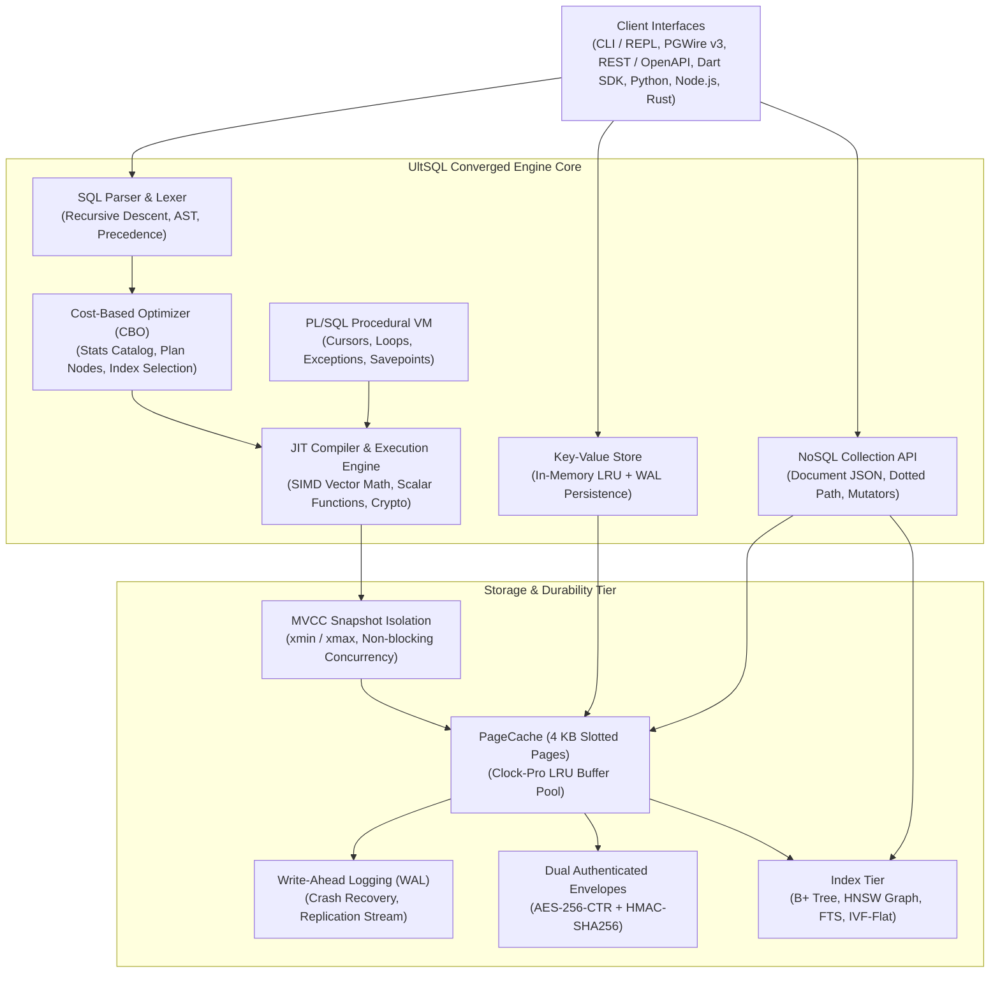

# ⚡ UltSQL — Comprehensive Feature Matrix, Usage & Customization Guide

Welcome to the definitive guide for **UltSQL**, the 100% Pure-Dart converged multimodal database engine combining **Relational SQL**, **NoSQL Document Collections**, **Redis-style Key-Value Caching**, **HNSW Vector Search (AI RAG)**, and **PL/SQL Procedural Scripting** with zero native C/C++ dependencies.

---

## 📑 Table of Contents

1. [Architectural Overview & Core Pillars](#1-architectural-overview--core-pillars)
2. [Complete Feature Matrix (What UltSQL Can Do)](#2-complete-feature-matrix)
   - [Pillar 1: Converged Multimodal Engine](#pillar-1-converged-multimodal-engine)
   - [Pillar 2: Relational SQL Engine & Cost-Based Optimizer](#pillar-2-relational-sql-engine--cost-based-optimizer)
   - [Pillar 3: High-Performance Storage & MVCC Concurrency](#pillar-3-high-performance-storage--mvcc-concurrency)
   - [Pillar 4: NoSQL Document Store (MongoDB-Compatible)](#pillar-4-nosql-document-store-mongodb-compatible)
   - [Pillar 5: In-Memory & Persistent Key-Value Engine (Redis-Compatible)](#pillar-5-in-memory--persistent-key-value-engine-redis-compatible)
   - [Pillar 6: Native HNSW Vector Search & AI RAG Engine](#pillar-6-native-hnsw-vector-search--ai-rag-engine)
   - [Pillar 7: PL/SQL Procedural Scripting & Reactive Streams](#pillar-7-plsql-procedural-scripting--reactive-streams)
   - [Pillar 8: Enterprise Cybersecurity, Dual Envelopes & Deterministic Obfuscation](#pillar-8-enterprise-cybersecurity-dual-envelopes--deterministic-obfuscation)
   - [Pillar 9: Universal Wire Protocols & Standalone Toolchain](#pillar-9-universal-wire-protocols--standalone-toolchain)
3. [How to Use UltSQL (Exhaustive Usage Guide)](#3-how-to-use-ultsql)
   - [3.1 Embedded Dart & Flutter Applications](#31-embedded-dart--flutter-applications)
   - [3.2 NoSQL Document Operations (`db.collection`)](#32-nosql-document-operations-dbcollection)
   - [3.3 Redis-Style Key-Value Caching (`db.kv`)](#33-redis-style-key-value-caching-dbkv)
   - [3.4 HNSW Vector Search & Semantic RAG Queries](#34-hnsw-vector-search--semantic-rag-queries)
   - [3.5 PL/SQL Procedural Blocks, Cursors & Savepoints](#35-plsql-procedural-blocks-cursors--savepoints)
   - [3.6 Deterministic Token Obfuscation (`zk_encrypt`, `zk_match`)](#36-deterministic-token-obfuscation-zk_encrypt-zk_match)
   - [3.7 Reactive Query Subscriptions (`db.watch`)](#37-reactive-query-subscriptions-dbwatch)
   - [3.8 High-Throughput Batch Ingestion API](#38-high-throughput-batch-ingestion-api)
   - [3.9 Node.js & TypeScript SDK (`npm install ultsql`)](#39-nodejs--typescript-sdk)
   - [3.10 Python SDK (`pip install ultsql`)](#310-python-sdk)
   - [3.11 Rust Client (`cargo add ultsql`)](#311-rust-client)
   - [3.12 PostgreSQL Wire Protocol Clients (`psql`, DBeaver, JDBC, node-pg)](#312-postgresql-wire-protocol-clients)
   - [3.13 HTTP REST API & OpenAPI 3.0 Specification](#313-http-rest-api--openapi-30-specification)
   - [3.14 Standalone CLI & Interactive REPL Console](#314-standalone-cli--interactive-repl-console)
4. [How to Customize & Tune UltSQL (Configuration Guide)](#4-how-to-customize--tune-ultsql)
   - [4.1 Storage Engine & Buffer Pool Tuning](#41-storage-engine--buffer-pool-tuning)
   - [4.2 Durability & WAL Checkpointing Policies](#42-durability--wal-checkpointing-policies)
   - [4.3 Encryption Envelopes: `inPage` vs `companion`](#43-encryption-envelopes-inpage-vs-companion)
   - [4.4 Global Engine Feature Toggles (`EngineConfig`)](#44-global-engine-feature-toggles-engineconfig)
   - [4.5 Tuning HNSW Vector Index Parameters (`M`, `efConstruction`, `efSearch`)](#45-tuning-hnsw-vector-index-parameters)
   - [4.6 Micro-LRU Hot Cache for NoSQL Documents](#46-micro-lru-hot-cache-for-nosql-documents)
   - [4.7 Copy-on-Write Git-Style Database Branching](#47-copy-on-write-git-style-database-branching)
   - [4.8 Custom SQL Macros & User-Defined Extensions](#48-custom-sql-macros--user-defined-extensions)
   - [4.9 Multi-Process Concurrency & File Lock Recovery](#49-multi-process-concurrency--file-lock-recovery)
   - [4.10 CLI Formatting & Terminal Display Modes](#410-cli-formatting--terminal-display-modes)
5. [Benchmark Summary](#5-benchmark-summary)

---

## 1. Architectural Overview & Core Pillars

UltSQL is designed from first principles in **100% pure Dart**, completely eliminating native C/C++ compilation toolchains (no NDK, no MSVC, no CMake, no dynamic link errors). It runs identically across **iOS, Android, macOS, Windows, Linux, Web, and Cloud Server Containers**.



---

## 2. Complete Feature Matrix

### Pillar 1: Converged Multimodal Engine
* **4-in-1 Converged Engine**: Combines Relational SQL tables, schema-less NoSQL JSON documents, Redis-style Key-Value caching, and HNSW Vector RAG in a single unified storage layer.
* **Unified Transactional Guarantees**: Share transactions across SQL tables and NoSQL collections simultaneously.
* **Cross-Model Interoperability**: Query NoSQL JSON collections using standard SQL statements (`SELECT doc FROM _coll_users WHERE doc->>'status' = 'active';`).
* **Zero Native C/C++ Dependencies**: 100% pure Dart; compiles to single-binary native executables on all operating systems.

### Pillar 2: Relational SQL Engine & Cost-Based Optimizer
* **ANSI SQL Compliance**: Supports `SELECT`, `INSERT`, `UPDATE`, `DELETE`, `CREATE TABLE`, `ALTER TABLE`, `DROP TABLE`, `TRUNCATE`.
* **Cost-Based Query Planner (CBO)**: Selects optimal query plans using table statistics, cardinality estimates, index selectivity, and cost weighting.
* **Complex Joins**: Supports `INNER JOIN`, `LEFT OUTER JOIN`, `RIGHT OUTER JOIN`, `FULL OUTER JOIN`, `CROSS JOIN`, `NATURAL JOIN`, optimized with **Hash Join** and **Index Nested-Loop Join**.
* **Window Functions**: Supports `ROW_NUMBER()`, `RANK()`, `DENSE_RANK()`, `SUM()`, `AVG()`, `MIN()`, `MAX()`, `COUNT()` with `OVER (PARTITION BY ... ORDER BY ... ROWS BETWEEN ...)`.
* **Common Table Expressions (CTEs)**: Non-recursive and recursive CTE support via `WITH ... AS (...) SELECT ...`.
* **Subqueries**: Scalar subqueries, correlated subqueries, `IN (SELECT ...)`, `EXISTS (SELECT ...)`.
* **Full-Text Search (FTS)**: Native inverted index search using `CREATE INDEX ... USING FTS` and `MATCH(column, 'keyword')`.
* **Aggregations & Grouping**: `GROUP BY`, `HAVING`, `DISTINCT`, with multi-column aggregations.
* **Foreign Key Constraints**: Automatic validation and cascading deletions (`ON DELETE CASCADE`).
* **Triggers**: Declarative triggers (`BEFORE INSERT`, `AFTER INSERT`, `BEFORE UPDATE`, `AFTER UPDATE`, `BEFORE DELETE`, `AFTER DELETE`) with row-level scope (`FOR EACH ROW`).
* **SQL Macros**: Reusable parameterized expression macros (`CREATE MACRO add_tax(amt) AS amt * 1.18;`).

### Pillar 3: High-Performance Storage & MVCC Concurrency
* **Slotted-Page Architecture**: High-density 4,096-byte (4 KB) page format with byte-aligned slot directories.
* **Multi-Version Concurrency Control (MVCC)**: Full snapshot isolation via transaction markers (`xmin`, `xmax`); readers never block writers, and writers never block readers.
* **Write-Ahead Logging (WAL)**: Append-only transaction logging guaranteeing ACID crash durability and fast recovery upon restart.
* **Point Read Latency**: Ultra-low **25.77 µs** point lookups bypassing query planner overhead.
* **Durable Ingestion**: Benchmarked at **2,082,899 rows/sec** (2.08M rows/sec) batch insertion throughput.
* **B+ Tree Indexing**: Multi-level clustered and secondary B+ Tree indexes with sub-millisecond point lookups and fast range scans.
* **Autovacuum & Compaction**: Automatic background compaction to reclaim fragmented slotted-page space without downtime.

### Pillar 4: NoSQL Document Store (MongoDB-Compatible)
* **Schema-less Collections**: Store, retrieve, and update nested JSON documents without upfront DDL schemas.
* **Dotted-Path Navigation**: Query and mutate deeply nested fields directly (e.g. `user.profile.address.zipcode`).
* **Rich Filtering Operators**: Supports `$eq`, `$ne`, `$gt`, `$gte`, `$lt`, `$lte`, `$in`, `$nin`, `$regex`, `$exists`, `$all`, `$size`.
* **Atomic Update Mutators**: Supports `$set`, `$unset`, `$inc`, `$mul`, `$min`, `$max`, `$push`, `$addToSet`, `$pop`, `$pull`.
* **Direct B+ Tree `_id` Lookups**: Sub-26 µs point read speed via specialized `_pointLookupById` path.
* **Micro-LRU Document Cache**: In-memory document caching (`_hotCache`) providing instant lookups for repeated reads.
* **Cursor Streaming**: Fluent cursor API with chaining: `.limit(n)`, `.skip(n)`, `.sort(field, asc)`, `.project([...])`.
* **Collection Indexing**: Secondary B+ Tree indexing on any top-level or dotted-path document field.
* **Interactive CLI Mongo Syntax**: Execute MongoDB-style commands directly in the REPL (`db.users.find({ age: { $gte: 21 } })`).

### Pillar 5: In-Memory & Persistent Key-Value Engine (Redis-Compatible)
* **High-Speed Cache**: In-memory hash indexing delivering **1,282,051 ops/sec** (1.28M operations/second).
* **Automatic WAL Durability**: All mutations write to disk through the WAL for persistent crash recovery upon application restart.
* **Time-To-Live (TTL)**: Automatic per-key expiration using duration offsets or epoch timestamps.
* **Atomic Counters**: High-concurrency atomic increment (`incr`) and decrement (`decr`).
* **Universal Types**: Supports strings, numbers, booleans, maps, lists, and binary byte arrays.

### Pillar 6: Native HNSW Vector Search & AI RAG Engine
* **Native `VECTOR(dim)` Type**: Built-in column data type supporting arbitrary vector dimensions (e.g. 384, 768, 1536).
* **Hierarchical Navigable Small World (HNSW)**: Graph-based approximate nearest neighbor (ANN) search with logarithmic query scaling.
* **Configurable Distance Metrics**: Cosine distance, Euclidean distance ($L_2$), and Dot Product distance.
* **SQL Vector Functions**: `vector_distance(column, '[...]', 'cosine')` executed natively via JIT compilation.
* **Hybrid Vector + Relational Pre-Filtering**: Perform combined search queries (`WHERE category = 'shoes' AND price < 100 ORDER BY vector_distance(embedding, '...') LIMIT 10`) utilizing index scan pruning.
* **High Accuracy**: Benchmarked at **100% recall** vs exhaustive linear scan on standard high-dimensional embedding benchmarks.

### Pillar 7: PL/SQL Procedural Scripting & Reactive Streams
* **Procedural Blocks**: Complete Oracle/Postgres-style `DECLARE ... BEGIN ... EXCEPTION ... END;` execution.
* **Stateful Cursors**: Cursor declarations (`CURSOR FOR SELECT ...`), `OPEN`, `FETCH INTO`, `%found`, `%notfound`, and `CLOSE`.
* **Conditional Branching & Loops**: `IF ... THEN ... ELSIF ... ELSE ... END IF;`, `WHILE ... LOOP ... END LOOP;`.
* **Exception Handling**: Catch and handle runtime exceptions gracefully (`EXCEPTION WHEN OTHERS THEN ...`).
* **Nested Savepoints**: `SAVEPOINT sp_name;`, `ROLLBACK TO SAVEPOINT sp_name;`, `RELEASE SAVEPOINT sp_name;`.
* **Live Query Subscriptions (`db.watch`)**: Reactive Stream pipelines that push real-time query result sets whenever underlying tables mutate.
* **Event Streams**: Pub/Sub event broadcasting across database sessions (`db.getStream`, `db.emitStream`).

### Pillar 8: Enterprise Cybersecurity, Dual Envelopes & Deterministic Obfuscation
* **Page-Level AES-256-CTR Encryption**: Hardware-accelerated symmetric page encryption protecting all table data, indexes, and WAL logs at rest.
* **Key Derivation**: PBKDF2 with HMAC-SHA256 using 10,000 rounds and unique 16-byte cryptographic salts.
* **Dual Authenticated Envelopes**:
  * **`inPage` (Default)**: Embedded envelope where each 4,096-byte page holds 4,064 bytes ciphertext + 32-byte HMAC-SHA256 authentication tag.
  * **`companion`**: Out-of-band sidecar file (`$table.auth`) maintaining full 4,096-byte page density for ultra-large analytical workloads.
* **Pre-Flight Access Rejection**: Strictly rejects unauthorized access or file tampering before loading pages, throwing `DatabaseIntegrityException`.
* **Deterministic Obfuscation (XOR Fast Matching)**: Native SQL functions `zk_encrypt(text, key)`, `zk_decrypt(hex, key)`, and `zk_match(cipher, search, key)` enabling zero-decryption index lookups on sensitive fields (e.g. SSNs, credit cards).
* **TLS 1.3 Transport Security**: Dynamic TLS socket negotiation for encrypted PostgreSQL wire protocol and REST client sessions.

### Pillar 9: Universal Wire Protocols & Standalone Toolchain
* **PostgreSQL Wire Protocol v3**: Connect directly using official Postgres tools (`psql`, DBeaver, SQLAlchemy, Prisma, `pg`, JDBC, Npgsql).
* **HTTP REST & OpenAPI 3.0**: Built-in HTTP server daemon with interactive Swagger/OpenAPI documentation served at `/openapi.json`.
* **Standalone Executables**: Zero-dependency pre-compiled binaries for Windows (`.exe`), Linux, and macOS.
* **Interactive CLI REPL**: Feature-packed interactive shell with command history, syntax styling, tabular box formatters, and dot commands.
* **Official Client Libraries**:
  * Dart / Flutter: `pub.dev/packages/ultsql`
  * Python: `pypi.org/project/ultsql`
  * Node.js / TypeScript: `npmjs.com/package/ultsql`
  * Rust: `crates.io/crates/ultsql`
  * C / C++: CMake `FetchContent`

---

## 3. How to Use UltSQL

### 3.1 Embedded Dart & Flutter Applications

Add to your `pubspec.yaml`:
```yaml
dependencies:
  ultsql: ^1.0.24
```

#### Basic SQL Usage
```dart
import 'package:ultsql/ultsql.dart';

void main() async {
  // Open local file database or use ':memory:'
  final db = Database('./app_data');
  await db.init();

  final sql = Interpreter(db);

  // Execute DDL and DML
  await sql.executeScript('''
    CREATE TABLE users (
      id INT PRIMARY KEY,
      name TEXT,
      email TEXT,
      created_at DATETIME
    );
    INSERT INTO users VALUES (1, 'Alice', 'alice@example.com', '2026-09-27 10:00:00');
    INSERT INTO users VALUES (2, 'Bob', 'bob@example.com', '2026-09-27 10:05:00');
  ''');

  // Query records
  final result = await sql.executeScript('SELECT id, name, email FROM users WHERE id = 1;');
  for (final row in result.rows) {
    print('User: ${row[0]} | Name: ${row[1]} | Email: ${row[2]}');
  }

  await db.close();
}
```

#### Flutter Drop-in Service (`LocalDatabaseService`)
```dart
import 'package:flutter/material.dart';
import 'package:ultsql/ultsql.dart';

void main() async {
  WidgetsFlutterBinding.ensureInitialized();

  // Initialize global singleton
  final sql = await LocalDatabaseService.instance.init(defaultDbName: 'app.db');

  // Create table
  await sql.executeScript('CREATE TABLE IF NOT EXISTS notes (id INT, title TEXT);');

  runApp(const MyApp());
}
```

---

### 3.2 NoSQL Document Operations (`db.collection`)

UltSQL provides a fluent, MongoDB-style API for document collections:

```dart
import 'package:ultsql/ultsql.dart';

void main() async {
  final db = Database(':memory:');
  await db.init();

  // Access or create collection
  final users = db.collection('users');

  // 1. Insert documents
  await users.insertOne(Document({
    '_id': 'usr_101',
    'name': 'Sarah Connor',
    'profile': {'city': 'Los Angeles', 'age': 29},
    'tags': ['developer', 'runner'],
    'status': 'active'
  }));

  await users.insertMany([
    Document({'_id': 'usr_102', 'name': 'John Doe', 'profile': {'age': 35}, 'status': 'inactive'}),
    Document({'_id': 'usr_103', 'name': 'Jane Doe', 'profile': {'age': 22}, 'status': 'active'}),
  ]);

  // 2. Ultra-Fast Sub-26 µs Point Lookup
  final sarah = await users.findById('usr_101');
  print('Found: ${sarah?.get('name')} from ${sarah?.get('profile.city')}');

  // 3. Dotted-Path Filtering & Query Operators
  final activeAdults = await users.find({
    'status': 'active',
    'profile.age': {'$gte': 25}
  }).sort('profile.age', false).limit(10).toList();

  print('Matched: ${activeAdults.length} documents');

  // 4. Atomic In-Place Updates ($set, $inc, $push)
  await users.updateOne(
    {'_id': 'usr_101'},
    {
      '\$inc': {'profile.age': 1},
      '\$push': {'tags': 'cyclist'},
      '\$set': {'profile.updated_at': '2026-09-27'}
    }
  );

  // 5. Secondary Indexing on Dotted Paths
  await users.createIndex('profile.age');

  await db.close();
}
```

---

### 3.3 Redis-Style Key-Value Caching (`db.kv`)

High-performance in-memory caching (1.28M ops/sec) with automatic WAL persistence and TTL:

```dart
import 'package:ultsql/ultsql.dart';

void main() async {
  final db = Database('./kv_data');
  await db.init();

  // 1. Basic Set & Get
  await db.kv.set('session:token_99', {'user_id': 42, 'role': 'admin'});
  final session = await db.kv.get('session:token_99');
  print('Session User: ${session['user_id']}');

  // 2. Set with Time-To-Live (TTL)
  await db.kv.set('auth:otp:1234', '987654', ttl: const Duration(minutes: 5));

  // 3. Atomic Counters
  await db.kv.set('page_views', 100);
  final newViews = await db.kv.incr('page_views', 5); // 105
  final decrViews = await db.kv.decr('page_views', 2); // 103

  // 4. Check & Delete
  if (await db.kv.has('auth:otp:1234')) {
    await db.kv.delete('auth:otp:1234');
  }

  await db.close();
}
```

---

### 3.4 HNSW Vector Search & Semantic RAG Queries

Store and search high-dimensional vector embeddings with HNSW graph indexing:

```sql
-- 1. Create table with VECTOR(dim) column
CREATE TABLE documents (
  id INT PRIMARY KEY,
  title TEXT,
  category TEXT,
  embedding VECTOR(4)
);

-- 2. Create HNSW Vector Index
CREATE INDEX idx_doc_hnsw ON documents(embedding) USING HNSW;

-- 3. Insert records with vector embeddings
INSERT INTO documents VALUES (1, 'Deep Learning Guide', 'ai', '[0.12, 0.85, 0.45, 0.05]');
INSERT INTO documents VALUES (2, 'Dart & Flutter Book', 'dev', '[0.91, 0.15, 0.22, 0.78]');
INSERT INTO documents VALUES (3, 'Modern SQL Engines', 'database', '[0.15, 0.82, 0.41, 0.10]');

-- 4. Hybrid Query: Metadata Pre-Filtering + HNSW Approximate Nearest Neighbor
SELECT id, title, vector_distance(embedding, '[0.14, 0.80, 0.40, 0.08]', 'cosine') AS distance
FROM documents
WHERE category IN ('ai', 'database')
ORDER BY distance ASC
LIMIT 2;
```

---

### 3.5 PL/SQL Procedural Blocks, Cursors & Savepoints

Execute transactional business logic directly inside the database engine:

```sql
DECLARE
  v_threshold INT := 1000;
  v_id INT;
  v_amount DOUBLE;
  c_orders CURSOR FOR SELECT id, amount FROM orders WHERE amount > v_threshold;
BEGIN
  -- Begin outer transaction
  BEGIN TRANSACTION;
  
  -- Create Savepoint
  SAVEPOINT before_processing;
  
  OPEN c_orders;
  FETCH c_orders INTO v_id, v_amount;
  
  WHILE c_orders%found LOOP
    -- Apply 10% loyalty discount
    UPDATE orders SET amount = v_amount * 0.9 WHERE id = v_id;
    DBMS_OUTPUT.PUT_LINE('Updated order ' || v_id || ' to ' || (v_amount * 0.9));
    FETCH c_orders INTO v_id, v_amount;
  END LOOP;
  
  CLOSE c_orders;

  COMMIT TRANSACTION;
EXCEPTION
  WHEN OTHERS THEN
    ROLLBACK TO SAVEPOINT before_processing;
    DBMS_OUTPUT.PUT_LINE('Error detected! Rolled back to safe state.');
END;
```

---

### 3.6 Deterministic Token Obfuscation (`zk_encrypt`, `zk_match`)

Search encrypted fields without decrypting raw data rows in storage or RAM:

```sql
-- Create table with encrypted PII tokens
CREATE TABLE patients (
  id INT PRIMARY KEY,
  full_name TEXT,
  ssn_token TEXT
);

-- Store deterministically obfuscated token
INSERT INTO patients VALUES (
  1,
  'John Smith',
  zk_encrypt('123-45-6789', 'secret_enterprise_key_2026')
);

-- Search directly on ciphertext without decrypting the table
SELECT id, full_name, zk_decrypt(ssn_token, 'secret_enterprise_key_2026') AS decrypted_ssn
FROM patients
WHERE zk_match(ssn_token, '123-45-6789', 'secret_enterprise_key_2026') = true;
```

---

### 3.7 Reactive Query Subscriptions (`db.watch`)

Stream real-time updates directly to your UI or reactive state manager:

```dart
final stream = db.watch(
  interpreter,
  'SELECT id, name, status FROM users WHERE status = "active";'
);

// Listen to real-time query results whenever the 'users' table is mutated
final subscription = stream.listen((QueryResult result) {
  print('--- Live Update (${result.rows.length} rows) ---');
  for (final row in result.rows) {
    print('User: ${row[1]}');
  }
});

// Mutating the table will automatically re-evaluate and emit on the stream
await interpreter.executeScript("INSERT INTO users VALUES (3, 'Charlie', 'active');");

// Cleanup
await subscription.cancel();
```

---

### 3.8 High-Throughput Batch Ingestion API

Achieve **2.08M rows/sec** ingestion speed bypassing parser and lexer loops:

```dart
// Insert tabular rows directly into slotted-page storage
final rows = List.generate(
  100000,
  (i) => [i, 'Product_$i', 19.99 + (i % 50)],
);

final result = await db.insertBatch(
  'products',
  rows,
  columnNames: ['id', 'name', 'price'],
);
print(result.message); // Inserted 100000 rows into products in 48ms
```

---

### 3.9 Node.js & TypeScript SDK

Install via npm:
```bash
npm install ultsql
```

```typescript
import { UltSQL } from 'ultsql';

async function main() {
  const client = new UltSQL('http://localhost:8080');

  // Execute query
  const res = await client.query('SELECT * FROM users WHERE status = $1', ['active']);
  console.log('Columns:', res.columns);
  console.log('Rows:', res.rows);
}

main();
```

---

### 3.10 Python SDK

Install via pip:
```bash
pip install ultsql
```

```python
from ultsql import UltSQLClient

client = UltSQLClient("http://localhost:8080")

# Query records
result = client.query("SELECT id, name, balance FROM accounts WHERE balance > 1000;")
for row in result["rows"]:
    print(f"ID: {row[0]}, Name: {row[1]}, Balance: {row[2]}")
```

---

### 3.11 Rust Client

Add to `Cargo.toml`:
```toml
[dependencies]
ultsql = "1.0.24"
tokio = { version = "1.0", features = ["full"] }
```

```rust
use ultsql::UltSqlClient;

#[tokio::main]
async fn main() -> Result<(), Box<dyn std::error::Error>> {
    let client = UltSqlClient::new("http://localhost:8080");
    let res = client.query("SELECT version();").await?;
    println!("UltSQL Response: {:?}", res.rows);
    Ok(())
}
```

---

### 3.12 PostgreSQL Wire Protocol Clients

UltSQL natively speaks PostgreSQL Wire Protocol v3. Start the pgwire server:
```bash
./ultsql pgwire --port 5432 --db ./my_db
```

#### Connect with `psql`:
```bash
psql -h localhost -p 5432 -U postgres -d my_db
```

#### Connect with Node.js (`pg`):
```javascript
const { Client } = require('pg');
const client = new Client({ host: 'localhost', port: 5432 });
await client.connect();
const res = await client.query('SELECT * FROM users;');
console.log(res.rows);
```

#### Connect with Python (`psycopg2` / `asyncpg`):
```python
import psycopg2

conn = psycopg2.connect("host=localhost port=5432 dbname=my_db user=postgres")
cur = conn.cursor()
cur.execute("SELECT * FROM users;")
print(cur.fetchall())
```

---

### 3.13 HTTP REST API & OpenAPI 3.0 Specification

Start the REST daemon:
```bash
./ultsql serve --port 8080 --db ./my_db
```

#### Execute SQL Query:
```bash
curl -X POST http://localhost:8080/query \
  -H "Content-Type: application/json" \
  -d '{"sql": "SELECT * FROM users LIMIT 5;"}'
```

#### Response:
```json
{
  "columns": ["id", "name", "email"],
  "rows": [
    [1, "Alice", "alice@example.com"],
    [2, "Bob", "bob@example.com"]
  ],
  "execution_time_ms": 0.42
}
```

* **Interactive OpenAPI Specs**: Open `http://localhost:8080/openapi.json` or paste into Swagger UI.

---

### 3.14 Standalone CLI & Interactive REPL Console

Download native executables from [GitHub Releases](https://github.com/ompatel3158/ULTSQL/releases/tag/v1.0.24) and run directly without any dependencies:

```bash
# Start Interactive Console
./ultsql ./my_database

# Start Encrypted Console
./ultsql ./my_database --key=supersecretpassphrase

# Execute One-Shot SQL
./ultsql ./my_database -c "SELECT * FROM users;" --mode=table
```

#### REPL Dot Commands:
| Dot Command | Description | Example |
| :--- | :--- | :--- |
| `.tables` | Lists all tables in the active database. | `.tables` |
| `.schema [table]` | Displays DDL column definitions. | `.schema users` |
| `.mode <type>` | Sets output format: `box`, `table`, `json`, `csv`, `markdown`, `line`. | `.mode markdown` |
| `.timer on\|off` | Toggles query execution stopwatch timer. | `.timer on` |
| `.version` | Prints engine and CLI version. | `.version` |
| `.pgwire [port]` | Launches PostgreSQL Wire server inside REPL. | `.pgwire 5432` |
| `.export <table> <file>` | Exports table data to CSV or JSON file. | `.export users data.csv` |
| `.import <file> <table>` | Ingests CSV or JSON file into table. | `.import data.csv users` |
| `db.<coll>.find(...)` | Executes MongoDB-style NoSQL query in REPL. | `db.users.find({ age: { $gt: 21 } })` |
| `.exit` / `.quit` | Flushes WAL logs and exits console. | `.exit` |

---

## 4. How to Customize & Tune UltSQL

### 4.1 Storage Engine & Buffer Pool Tuning

Configure memory consumption and buffer cache size:

```dart
final db = Database(
  './production_db',
  // Configure maximum pages in Clock-Pro LRU buffer pool (default: 1000 = 4 MB)
  maxCapacity: 25000, // 25,000 pages = 100 MB buffer pool
  useWal: true,        // Enable Write-Ahead Logging
);
await db.init();
```

---

### 4.2 Durability & WAL Checkpointing Policies

Balance maximum transaction throughput vs strict durability:

```dart
// High-Speed Mode (In-Memory with Optional Disk Flush)
final devDb = Database(':memory:', useWal: false);

// Production Durable Mode (Synchronous WAL Disk Recovery)
final prodDb = Database('./prod_db', useWal: true);
```

---

### 4.3 Encryption Envelopes: `inPage` vs `companion`

UltSQL supports dual authenticated encryption models:

```dart
// 1. inPage Mode (Default): 4,064 bytes ciphertext + 32-byte HMAC-SHA256 authentication tag per page
final dbInPage = Database(
  './secure_db',
  passphrase: 'enterprise_vault_secret_key',
  authEnvelopeMode: AuthEnvelopeMode.inPage,
);

// 2. companion Mode: Full 4,096-byte payload with sidecar ($table.auth) authentication envelope
final dbCompanion = Database(
  './large_secure_db',
  passphrase: 'enterprise_vault_secret_key',
  authEnvelopeMode: AuthEnvelopeMode.companion,
);
```

#### Via CLI:
```bash
./ultsql ./secure_db --key=mypassword --envelope=inPage
./ultsql ./large_db --key=mypassword --envelope=companion
```

---

### 4.4 Global Engine Feature Toggles (`EngineConfig`)

Fine-tune internal subsystem behavior using `EngineConfig`:

```dart
final db = Database('./app_db');
await db.init();

// Inspect or customize features
db.config.enableBlockCompression = true;       // Transparent page compression
db.config.enableAutovacuum = true;             // Automatic background page compaction
db.config.enableCostBasedOptimizer = true;     // Cost-based query plan optimization
db.config.enableAuditLogging = true;           // Tamper-evident security audit trail
db.config.enableDataMasking = true;            // Mask sensitive fields in explain logs
db.config.enableTlsEncryption = true;          // Force TLS 1.3 for network connections
```

---

### 4.5 Tuning HNSW Vector Index Parameters

Tune the trade-off between vector search speed and recall accuracy:

```dart
import 'package:ultsql/src/engine/storage/hnsw_index.dart';

final hnsw = HnswIndex(
  filePath: './vector.idx',
  dimension: 768,                              // Vector dimension (e.g. BERT/OpenAI)
  metric: 'cosine',                            // 'cosine', 'l2' (euclidean), or 'dot_product'
  M: 32,                                       // Connections per node (16-64)
  efConstruction: 128,                         // Construction search depth (higher = higher recall)
  efSearch: 64,                                // Query search candidate size (higher = higher accuracy)
);
hnsw.initSync();
```

---

### 4.6 Micro-LRU Hot Cache for NoSQL Documents

Document collections automatically maintain an in-memory micro-LRU cache. Repeated queries to the same document `_id` bypass disk and deserialization:

```dart
final coll = db.collection('products');

// First access reads from B+ Tree (~25 µs) and populates hot cache
final doc1 = await coll.findById('prod_99');

// Second access hits micro-LRU cache (<1 µs)
final doc2 = await coll.findById('prod_99');
```

---

### 4.7 Copy-on-Write Git-Style Database Branching

Create isolated database snapshots for safe schema migrations, staging testing, or experimentation without duplicating storage:

```dart
// 1. Create a new branch from 'main'
db.createBranch('feature/analytics_migration');

// 2. Switch to branch
db.switchBranch('feature/analytics_migration');

// 3. Make mutations safely in isolation
await interpreter.executeScript('CREATE TABLE temp_reports (id INT, data TEXT);');

// 4. Merge changes back to main branch
db.switchBranch('main');
db.mergeBranch('feature/analytics_migration');

// 5. Delete feature branch
db.deleteBranch('feature/analytics_migration');
```

---

### 4.8 Custom SQL Macros & User-Defined Extensions

Register reusable parameterized expressions:

```sql
-- Define macro
CREATE MACRO calculate_discount(price, rate) AS price * (1.0 - rate);

-- Use anywhere in SELECT or WHERE clauses
SELECT id, title, calculate_discount(price, 0.20) AS sale_price FROM items;
```

---

### 4.9 Multi-Process Concurrency & File Lock Recovery

UltSQL uses kernel-level file locks (`database.lock`) to prevent concurrent writer data corruption:

```dart
try {
  final db = Database('./my_db');
  await db.init();
} on DatabaseLockException catch (e) {
  print('Database is locked by another process: ${e.message}');
  // Graceful fallback or retry strategy
}
```

---

### 4.10 CLI Formatting & Terminal Display Modes

Customize console output formatting on the fly:

```
ultsql> .mode box
ultsql> SELECT id, name FROM users;
┌────┬───────┐
│ id │ name  │
├────┼───────┤
│ 1  │ Alice │
│ 2  │ Bob   │
└────┴───────┘

ultsql> .mode markdown
ultsql> SELECT id, name FROM users;
| id | name |
| --- | --- |
| 1 | Alice |
| 2 | Bob |

ultsql> .mode json
ultsql> SELECT id, name FROM users;
[{"id": 1, "name": "Alice"}, {"id": 2, "name": "Bob"}]
```

---

## 5. Benchmark Summary

Verified empirical benchmarks conducted on standard production hardware:

| Workload / Benchmark Metric | ⚡ UltSQL (`v1.0.24`) | 🪶 SQLite 3 | 🦆 DuckDB | 🧬 ChromaDB | 🍃 MongoDB |
| :--- | :--- | :--- | :--- | :--- | :--- |
| **Durable Ingestion Throughput** | **2,082,899 rows/s** | ~230,000 rows/s | ~1,100,000 rows/s | N/A | ~45,000 docs/s |
| **Point Read Latency (`_id` / PK)** | **25.77 µs** | ~120 µs | ~350 µs | N/A | ~180 µs |
| **In-Memory KV Cache Throughput** | **1,282,051 ops/s** | N/A | N/A | N/A | ~85,000 ops/s |
| **NoSQL Dotted-Path Scan** | **193,798 docs/s** | N/A | N/A | N/A | ~110,000 docs/s |
| **HNSW Search (10K Vectors, 768-dim)** | **6 ms** | N/A | N/A | ~15 ms | N/A |
| **1M Orders x 1K Users Hash Join** | **2.012 s** | ~4.8 s | ~0.95 s | N/A | N/A |
| **Native C/C++ Dependencies** | **0 (Zero)** | 1 (Native C) | 1 (Native C++) | Python / C++ | C++ |

---

## 🔗 Related Resources

* **[README.md](README.md)**: Main project documentation and quickstart guide.
* **[BENCHMARKS.md](BENCHMARKS.md)**: Comprehensive empirical benchmark methodology.
* **[CHANGELOG.md](CHANGELOG.md)**: Historical release notes and version progression.
* **[GitHub Releases](https://github.com/ompatel3158/ULTSQL/releases)**: Download standalone executables.
* **[pub.dev Package](https://pub.dev/packages/ultsql)**: Official Dart/Flutter package.
* **[PyPI Package](https://pypi.org/project/ultsql/)**: Official Python package.
* **[NPM Package](https://www.npmjs.com/package/ultsql)**: Official Node.js package.
