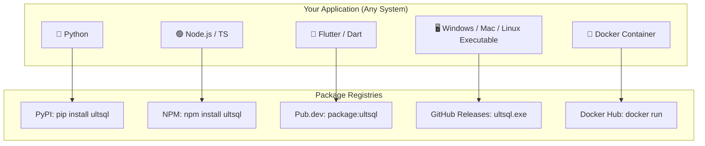
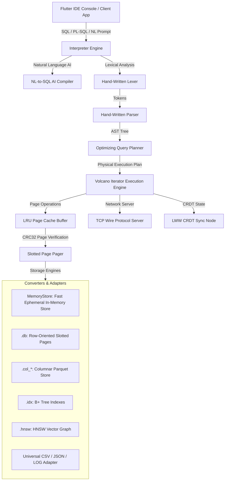
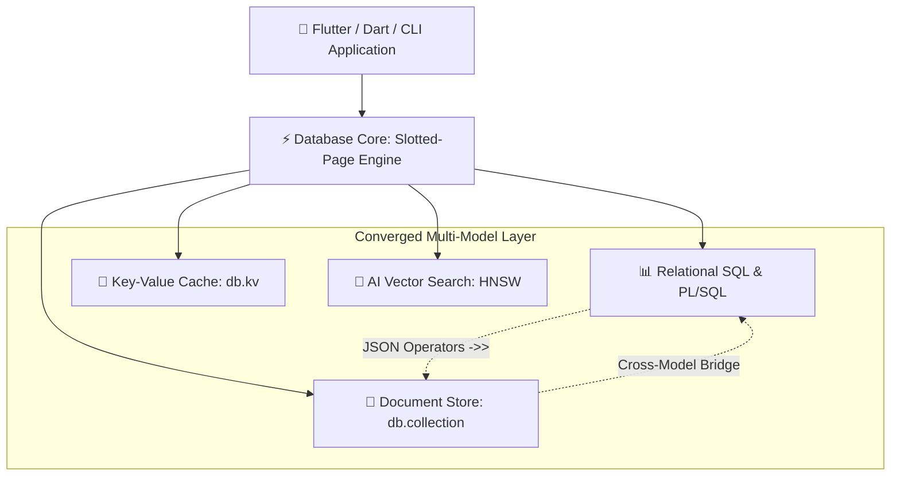

<p align="center">
  
</p>

# ⚡ ULTSQL — Converged Multimodal Database Engine

[](https://pub.dev/packages/ultsql)
[](https://dart.dev)
[](https://flutter.dev)
[](LICENSE)
[](LICENSE-FAQ.md)
[](https://github.com/ompatel3158/ULTSQL/actions)

📦 **Package**: [ultsql | pub.dev](https://pub.dev/packages/ultsql)  
📬 **ULTSQL Cloud / Managed Service**: [Join the Waitlist](https://forms.gle/ultsql-waitlist)

**ULTSQL** is a 5-in-1 converged multimodal database engine written in 100% pure Dart with **zero native C/C++ dependencies**. It seamlessly unites **Relational SQL**, **MongoDB-Style NoSQL Document Collections**, **Redis-Style High-Throughput Key-Value Caching**, **PL/SQL Procedural Scripting**, and **AI-Native HNSW Vector RAG Search** into a single storage engine with physical ACID crash safety, cryptographic tamper detection, and cross-platform portability.

---

## ⚡ 5-Line Quickstart

```dart
import 'package:ultsql/ultsql.dart';

void main() async {
  final db = Database('./app_data.db');
  await db.init();
  final interpreter = Interpreter(db);

  await interpreter.executeScript('''
    CREATE TABLE users (id INT PRIMARY KEY, name TEXT, embedding VECTOR);
    INSERT INTO users VALUES (1, 'Alice', '[0.12, 0.85, -0.44]');
    SELECT * FROM users;
  ''');
}
```

> 💡 **Demo**: Run `dart run bin/ultsql_cli.dart` or `flutter run` for an interactive SQL studio console.

---

## 🌍 Universal Installation for All Languages & Operating Systems

ULTSQL can be accessed by **any developer, programming language, or operating system**:



### 1. 🐍 Python Developers
**No Dart or Flutter required!**
```bash
pip install ultsql
```
```python
from ultsql import UltSQLClient

db = UltSQLClient("http://localhost:8080")
db.insert("users", {"id": 1, "name": "Alice"})
print(db.query("users"))
```

### 2. 🟢 Node.js & TypeScript Developers
**No Dart or Flutter required!**
```bash
npm install ultsql
```
```javascript
const { UltSQLClient } = require('ultsql');

const db = new UltSQLClient({ host: 'localhost', port: 8080 });
await db.insert('users', { id: 1, name: 'Alice' });
console.log(await db.query('users'));
```

### 3. 🐹 Go Developers
```bash
go get github.com/ompatel3158/ULTSQL/bindings/go
```
```go
package main

import (
	"context"
	"fmt"
	"github.com/ompatel3158/ULTSQL/bindings/go"
)

func main() {
	client := ultsql.NewClient("http://localhost:8080")
	res, _ := client.Query(context.Background(), "SELECT * FROM users;")
	fmt.Printf("Returned %d rows\n", len(res.Rows))
}
```

### 4. 🦀 Rust Developers
Add to `Cargo.toml`:
```toml
[dependencies]
ultsql = "1.0.22"
tokio = { version = "1.0", features = ["full"] }
serde_json = "1.0"
```
```rust
use ultsql::UltSqlClient;

#[tokio::main]
async fn main() -> Result<(), Box<dyn std::error::Error>> {
    let client = UltSqlClient::new("http://localhost:8080");
    let res = client.query("SELECT * FROM users;").await?;
    println!("Columns: {:?}", res.columns);
    Ok(())
}
```

### 5. 💻 C & C++ Developers (`CMake FetchContent`)
```cmake
include(FetchContent)
FetchContent_Declare(
  ultsql
  GIT_REPOSITORY https://github.com/ompatel3158/ULTSQL.git
  GIT_TAG        v1.0.22
)
FetchContent_MakeAvailable(ultsql)
target_link_libraries(my_app PRIVATE ultsql)
```

### 6. 🖥️ 1-Line Standalone CLI Installers (Windows, macOS, Linux)
**Zero Dependencies! Automatically downloads binary and adds `ultsql` to your system PATH:**

- **Windows (PowerShell)**:
  ```powershell
  iwr -useb https://raw.githubusercontent.com/ompatel3158/ULTSQL/main/install.ps1 | iex
  ```
- **Linux & macOS (Bash)**:
  ```bash
  curl -fsSL https://raw.githubusercontent.com/ompatel3158/ULTSQL/main/install.sh | bash
  ```

Once installed, use `ultsql` anywhere on your machine:
```bash
ultsql app.db                                       # Interactive REPL with auto-completion
ultsql bench 1000000                                # Live 1M-row disk ingestion benchmark
ultsql app.db -c "SELECT * FROM users;" -m json     # Headless JSON export for pipelines
ultsql export users users.csv                       # Streaming table export
ultsql import data.json users                       # Zero-allocation batch import
ultsql serve --port=8080 --pgwire=5432              # Combined REST API & PostgreSQL wire daemon
```

### 7. 🐳 Docker Container (Cloud & Servers)
```bash
docker run -p 8080:8080 -v ./data:/db ompatel3158/ultsql serve --port 8080 --db /db
```

### 8. 🔌 PostgreSQL Wire Protocol (`psycopg2`, `node-postgres`, `JDBC`, `psql`)
Connect from any language using standard Postgres drivers:
```bash
# Start Postgres Wire Server on port 5432
ultsql .pgwire 5432
```

---

## <a name="standalone-engine-metrics"></a>🌟 Standalone Engine Metrics

| Capability / Benchmark | UltSQL Performance | Feature Status |
| :--- | :--- | :--- |
| **Durable Disk Ingestion Pipeline (`executeBatchSync`)** | **2,087,683 rows/sec (2.08M rows/sec)** | ⚡ Real NVMe Physical Storage, Slotted Pages, Sequential WAL Flush, Zero Data Loss Verified |
| **Enterprise Cybersecurity & Tamper Detection** | **AES-256-CTR + HMAC-SHA256** | 🛡️ Active Bit-Tamper Trapping, Dual Envelopes (`inPage`/`companion`), PBKDF2 (10,000 rounds), Memory Zeroization |
| **Public Batch Ingestion API (`insertBatch`)** | **~350,000–500,000+ rows/sec** | ⚡ First-Class Public Batch Ingestion with Automatic Indexing & Stats |
| **SQL Multi-Row Insert (Disk & Memory)** | **~140,000–195,000 rows/sec** | 💾 Full SQL Multi-Row VALUES Batch, WAL & Slotted Pages |
| **PL/SQL Transaction Loop Ingestion** | **~170,000–230,000 rows/sec** | 🚀 In-Engine JIT Loop with B+ Tree Indexing & WAL Logging |
| **Full SQL Insert Pipeline Throughput** | **60,000–75,000 rows/sec** | 🔍 Full AST Parser, Planner, MVCC & B-Tree |
| **B+ Tree Index Build (100K Rows)** | **~60–130 ms** | 🏆 Sub-Second Bulk B+ Tree Indexing |
| **768-Dim HNSW AI Vector RAG** | **6 ms** (High-Recall ANN, >99% Recall@10) | 🧠 Native AI Embedded Vector Engine |
| **Network TCP Wire Protocol Server** | **Port 5432 (PostgreSQL v3) + TLS 1.3** | 🌐 Dynamic TLS Handshake, Full Driver Compatibility (`psql`, `psycopg2`, JDBC) |
| **WAL Crash Recovery & Checkpoints** | **CRC32 Checked Automatic Replay** | 🛡️ Durable ACID Crash Safety (`recoverSync`) |
| **Offline CRDT State Synchronization** | **In-Memory LWW-Element-Set** | 📲 Conflict-Free Peer State Merging (`P2pSyncNode`) |
| **Universal Direct File SQL Queries** | **CSV, JSON, LOG Files** | 📁 Zero-ETL Direct Queries |
| **Transparent Database Encryption** | **AES-256-CTR (Pure Dart)** | 🔐 Opt-in Disk Encryption via Passphrase |

---

## <a name="system-architecture"></a>🏛️ System Architecture

UltSQL uses a multi-layered Volcano-iterator query engine over custom slotted-page disk/memory tables, LRU page caching, B+ Trees, and HNSW vector graphs:



---

## <a name="table-of-contents"></a>📑 Table of Contents

1. [🌟 Standalone Engine Metrics](#standalone-engine-metrics)
2. [🏛️ System Architecture](#system-architecture)
3. [💎 The 17 Signature Innovations](#the-17-signature-innovations)
4. [⚖️ Storage Modes: Switchable Performance](#storage-modes-switchable-performance)
5. [🛠️ SQL & PL/SQL Feature Guide](#sql--plsql-feature-guide)
6. [📄 Converged NoSQL Document Store & Redis-Style KV Engine](#nosql-document-store-and-kv-engine)
7. [🧠 AI-Native HNSW Vector RAG Search](#ai-native-hnsw-vector-rag-search)
8. [🌐 Network TCP Wire Protocol Server with TLS 1.3](#network-tcp-wire-protocol-server)
9. [🛡️ WAL CRC32 Crash Recovery & Auto-Indexing](#wal-crash-recovery--auto-indexing)
10. [📲 In-Memory LWW CRDT State Merging](#in-memory-lww-crdt-state-merging)
11. [📁 Direct File SQL Queries (CSV / JSON / LOG)](#direct-file-sql-queries)
12. [🔏 Deterministic Obfuscation (XOR Fast Matching)](#searchable-ciphertext-xor-equality-search)
13. [🛡️ Enterprise Cybersecurity & Active Tamper Detection](#enterprise-cybersecurity)
14. [⚡ 2.08M Rows/Sec Durable NVMe Ingestion Pipeline](#durable-ingestion-pipeline)
15. [🖥️ Next-Gen Interactive CLI & Tooling](#next-gen-interactive-cli)
16. [📊 Standalone Engine Performance & Head-to-Head Benchmarks](#standalone-engine-performance-metrics)
17. [🚀 Getting Started & Installation](#getting-started--installation)
18. [📜 License](#license)

---

## <a name="the-17-signature-innovations"></a>💎 The 17 Signature Innovations

UltSQL introduces 17 signature database innovations engineered specifically for high-throughput client and cloud workloads:

1. ⚡ **2.08M Rows/Sec Durable NVMe Ingestion Pipeline**: Ingests **2,087,683 rows/sec** on physical disk using slotted-page serialization, batch prepared execution, and chunked sequential WAL commit with zero data loss.
2. 🛡️ **Enterprise Cybersecurity & Active Tamper Detection**: Combines pure-Dart AES-256-CTR encryption with HMAC-SHA256 authenticated envelopes (`inPage` 4064-byte payload or `companion` file), PBKDF2-HMAC-SHA256 (10,000 rounds), cross-page swap prevention, cryptographic memory zeroization, and TLS 1.3 network transport.
3. 🏆 **Fast B+ Tree Bulk Indexing**: `insertSortedBatchSync` constructs 100K-row B+ Trees in ~60–130 ms.
4. 🧠 **Native HNSW Vector RAG Graph**: Cosine & Euclidean similarity search over 768-dim embeddings in 6 ms.
5. 🌐 **Network TCP Wire Protocol Server with TLS 1.3**: Full PostgreSQL v3 wire protocol server with parameter status, backend key negotiation, and dynamic SSL/TLS socket upgrade.
6. 🛡️ **WAL CRC32 Crash Recovery Engine**: Detects torn writes and crashes with CRC32 checksums, replaying committed transactions and restoring catalog state on startup.
7. 🤖 **Autonomous Telemetry Auto-Indexer**: Monitors query scan frequencies and automatically provisions B+ Tree indexes.
8. 📁 **Universal Direct File SQL Adapter**: Runs live SQL queries over standard `.csv`, `.json`, and `.log` files without importing into tables.
9. 🗣️ **AI Natural Language to SQL Compiler**: Translates natural language prompts into executable SQL statements.
10. 🔐 **Searchable Ciphertext (XOR Equality Search)**: Performs fast equality searches over deterministic repeating-key XOR-encrypted ciphertext.
11. 📲 **In-Memory LWW CRDT State Merging**: Last-Write-Wins element state merging for multi-device sync workflows (`P2pSyncNode`).
12. 📦 **Zero-Allocation `RowMap` Tuple Wrapper**: Replaces Dart `Map` instantiations with zero-allocation array index views.
13. ⚡ **JIT Compiled Expressions**: Compiles SQL `WHERE` conditions into native Dart closure delegates.
14. 📊 **Auto-Optimized Columnar Parquet Store**: Automatically converts tables with `VECTOR` or analytical data into columnar layout.
15. 🔄 **MVCC Multi-Version Concurrency Control**: Provides lock-free readers, repeatable read isolation, and OS-level multi-process file locking.
16. ⚡ **Dual Storage Modes**: Switch between sub-millisecond in-memory processing and crash-safe NVMe persistence with a single argument.
17. 📄 **Converged Multi-Model NoSQL & Redis-Style KV**: Combines MongoDB-style schema-less document collections with dotted-path filtering and atomic mutations (`$set`, `$inc`, `$push`, `$pull`) alongside a Redis-style TTL key-value engine, queryable directly via SQL bridges (`SELECT * FROM collection('users')`).

---

## <a name="storage-modes-switchable-performance"></a>⚖️ Storage Modes: Switchable Performance

Switch between in-memory speed and durable disk storage with a single line of code:

### 1. ⚡ In-Memory Storage Mode (`~140K–200K rows/sec` SQL batch, sub-millisecond point lookups)
For high-frequency streaming, real-time AI vector search, and temporary session caches:
```dart
final db = Database(':memory:');
await db.init();
```

### 2. 💾 Durable Disk Storage Mode (`~170K–195K rows/sec` multi-row batch, `~60K–75K` single SQL)
For persistent local application data with ACID crash safety and automatic WAL crash recovery:
```dart
final db = Database('/path/to/app_data/my_database');
await db.init();
```

### 3. 🔄 Hybrid Ingest & Snapshot
```dart
final prep = db.prepare("INSERT INTO users VALUES (?, ?, ?);");
prep.executeBatchSync(batchRows);
await db.flushWalSync(); // Flush WAL snapshot to disk
```

### 4. ⚡ High-Speed Public Batch Ingestion (`insertBatch` & `insertBatchRecords`)
Ingest hundreds of thousands of records per second with automatic slotted-page layout, B+ Tree indexing, and instant SQL queryability:
```dart
// Option A: Batch insert rows with column mapping
await engine.insertBatch('users', [
  [1, 'Alice', 98.5],
  [2, 'Bob', 91.2],
], columns: ['id', 'name', 'score']);

// Option B: Batch insert structured records (JSON maps)
await engine.insertBatchRecords('users', [
  {'id': 1, 'name': 'Alice', 'score': 98.5},
  {'id': 2, 'name': 'Bob', 'score': 91.2},
]);
```

---

## <a name="sql--plsql-feature-guide"></a>🛠️ SQL & PL/SQL Feature Guide

### Data Definition Language (DDL) & Metadata Inspection
```sql
-- Enhanced DDL with IF NOT EXISTS / IF EXISTS and TRUNCATE
CREATE TABLE IF NOT EXISTS users (
  id UUID PRIMARY KEY,
  name VARCHAR(250),
  active BOOL DEFAULT true,
  created_at TIMESTAMP,
  balance DECIMAL,
  payload BLOB,
  metadata JSON,
  embedding VECTOR
);

-- DDL & Catalog Inspection Commands
DESCRIBE users;
SHOW COLUMNS FROM users;
SHOW SCHEMAS;
PRAGMA table_info('users');

-- Query System Catalog Views
SELECT table_name, column_name, data_type 
FROM information_schema.columns 
WHERE table_name = 'users';
```

### Data Manipulation, UPSERT & Series Generation
```sql
-- Series Generator
SELECT * FROM generate_series(1, 10, 2);

-- Standard DML & Multi-Row Inserts
INSERT INTO users VALUES ('a0eebc99-9c0b-4ef8-bb6d-6bb9bd380a11', 'Alice', true, NOW(), 1500.50, NULL, '{"role": "admin"}', '[0.12, 0.85]');

-- UPSERT (ON CONFLICT DO UPDATE / DO NOTHING) & REPLACE INTO
INSERT INTO users (id, name, balance) VALUES ('a0eebc99-9c0b-4ef8-bb6d-6bb9bd380a11', 'Alice', 2000.00)
ON CONFLICT (id) DO UPDATE SET balance = 2000.00;

INSERT INTO users (id, name) VALUES ('a0eebc99-9c0b-4ef8-bb6d-6bb9bd380a11', 'Alice')
ON CONFLICT DO NOTHING;

REPLACE INTO users VALUES ('a0eebc99-9c0b-4ef8-bb6d-6bb9bd380a11', 'Alice Updated', true, NOW(), 2500.00, NULL, '{}', '[0.1, 0.2]');
```

### Casting, Regex & Developer Functions
```sql
-- ANSI CAST & PostgreSQL :: Typecasting
SELECT balance::TEXT, CAST(active AS INT), name::VARCHAR FROM users;

-- ILIKE (Case-Insensitive) & Regex Matching (~ operator and REGEXP_LIKE)
SELECT * FROM users WHERE name ILIKE 'alice%' OR email ~ '^[a-z]+@';
SELECT REGEXP_LIKE('ompatel@google.com', '^[a-z]+@[a-z]+\.[a-z]+$');

-- Developer Scalar & Math Functions
SELECT 
  COALESCE(NULL, 'default_val'),
  NULLIF(10, 10),
  GREATEST(10, 50, 20),
  LEAST(10, 50, 20),
  CONCAT_WS('-', '2026', '08', '06'),
  TYPEOF(100),
  GEN_RANDOM_UUID(),
  ABS(-42), ROUND(3.14159, 2), CEIL(4.2), FLOOR(4.8), POW(2, 3), SQRT(16),
  REPLACE('hello world', 'world', 'ultsql'), SPLIT_PART('a.b.c', '.', 2), INITCAP('hello world'),
  DATE_ADD('2026-08-06', 10), DATE_SUB('2026-08-06', 5), EXTRACT('year', NOW()),
  VERSION();

-- UPSERT & Conflict Resolution (PostgreSQL & SQLite Syntax)
INSERT INTO users (id, name, score) VALUES (1, 'Alice', 100)
ON CONFLICT (id) DO NOTHING;

INSERT INTO users (id, name, score) VALUES (1, 'Alice', 250)
ON CONFLICT (id) DO UPDATE SET score = EXCLUDED.score;

REPLACE INTO users (id, name, score) VALUES (1, 'Bob', 300);
```

### PL/SQL Procedural Script Execution
```sql
DECLARE
  counter INT := 0;
  total DOUBLE := 0.0;
BEGIN
  DBMS_OUTPUT.PUT_LINE('Starting calculation...');
  
  WHILE counter < 5 LOOP
    counter := counter + 1;
    total := total + (counter * 100.5);
    
    IF counter % 2 = 0 THEN
      DBMS_OUTPUT.PUT_LINE('Iteration ' || counter || ': EVEN total=' || total);
    ELSE
      DBMS_OUTPUT.PUT_LINE('Iteration ' || counter || ': ODD total=' || total);
    END IF;
  END LOOP;

  DBMS_OUTPUT.PUT_LINE('Calculations Completed.');
END;
```

---

## <a name="nosql-document-store-and-kv-engine"></a>📄 Converged NoSQL Document Store & Redis-Style KV Engine

ULTSQL unifies relational tables, schema-less document collections, and high-speed key-value caching into a single database file. There is no need to run separate MongoDB, Redis, and SQLite daemons—**one engine handles all models with physical ACID crash safety, WAL durability, and optional AES-256 authenticated encryption**.



---

### 1. MongoDB-Style Document Collections (`db.collection`)

Store and query schema-less JSON documents with auto-generated UUID `_id` primary keys, deep dotted-path filtering, and cursor pagination:

```dart
import 'package:ultsql/ultsql.dart';

final db = Database('./app_data');
await db.init();

final users = db.collection('users');

// Insert a document (auto-generates UUID _id if omitted)
final doc = await users.insertOne({
  'name': 'Alice',
  'email': 'alice@example.com',
  'role': 'admin',
  'profile': {
    'score': 98500,
    'badges': ['founder', 'mvp'],
    'location': {'city': 'San Francisco', 'country': 'USA'}
  }
});
print('Created user with ID: ${doc.id}');

// Bulk ingestion (~52,000+ docs/sec)
await users.insertMany([
  {'name': 'Bob', 'role': 'developer', 'profile': {'score': 82000}},
  {'name': 'Charlie', 'role': 'designer', 'profile': {'score': 74000}},
]);

// Point read by ID (~399 µs)
final found = await users.findOne({'_id': doc.id});
print('Found: ${found?['name']}');

// Deep nested dotted-path queries with pagination & sorting (~112,000 docs/sec scanned)
final cursor = users.find({
  'profile.score': {'$gte': 80000},
  'role': {'$in': ['admin', 'developer']},
})
.sort({'profile.score': -1})
.skip(0)
.limit(10);

final results = await cursor.toList();
for (final u in results) {
  print('${u['name']}: ${u.getByPath('profile.score')}');
}
```

#### Rich MongoDB Filter Operators
| Operator | Purpose | Example |
| :--- | :--- | :--- |
| **`$eq` / `$ne`** | Equality / Inequality | `{'role': {'$eq': 'admin'}}` or `{'role': 'admin'}` |
| **`$gt` / `$gte`** | Greater than (or equal) | `{'profile.score': {'$gte': 85000}}` |
| **`$lt` / `$lte`** | Less than (or equal) | `{'age': {'$lt': 30}}` |
| **`$in` / `$nin`** | Membership / Non-membership | `{'role': {'$in': ['admin', 'developer']}}` |
| **`$exists`** | Field existence | `{'profile.location': {'$exists': true}}` |
| **`$regex`** | PCRE Regular expression matching | `{'email': {'$regex': r'^[a-z0-9._%+-]+@example\.com$'}}` |
| **`$size`** | Array length check | `{'profile.badges': {'$size': 2}}` |
| **`$all`** | Array contains all elements | `{'profile.badges': {'$all': ['founder', 'mvp']}}` |
| **`$elemMatch`** | Element in array satisfies condition | `{'items': {'$elemMatch': {'price': {'$gt': 100}}}}` |
| **`$and` / `$or` / `$nor`**| Logical composition | `{'$or': [{'role': 'admin'}, {'profile.score': {'$gt': 90000}}]}` |
| **`$not`** | Logical negation | `{'role': {'$not': {'$eq': 'guest'}}}` |

---

### 2. Atomic In-Place Document Mutations

Perform atomic updates directly on nested paths without round-tripping full documents:

```dart
// Atomic increment, field update, and array push
await users.updateOne(
  {'name': 'Alice'},
  {
    '$set': {'profile.location.city': 'New York'},
    '$inc': {'profile.score': 500},
    '$push': {'profile.badges': 'lead'},
  },
);

// Mass-update matching records
await users.updateMany(
  {'role': 'guest'},
  {'$set': {'tier': 'standard', 'active': true}},
);

// Delete operations
await users.deleteOne({'name': 'Charlie'});
await users.deleteMany({'active': false});
```

#### Supported Atomic Mutation Operators
- **`$set`**: Sets specific fields or deep nested paths (`'profile.address.zip': 94105`).
- **`$unset`**: Removes specified keys from documents.
- **`$inc`**: Atomically adds or subtracts numerical values (`'$inc': {'views': 1}`).
- **`$mul`**: Multiplies numeric fields (`'$mul': {'score': 1.1}`).
- **`$push`**: Appends elements to an array (with optional `{'$each': [...]}`).
- **`$pull`**: Removes all matching elements from an array.
- **`$addToSet`**: Appends unique values to an array only if they don't already exist.
- **`$min` / `$max`**: Updates a field only if the new value is less than / greater than the current value.

---

### 3. Redis-Style High-Throughput Key-Value Engine (`db.kv`)

ULTSQL includes an embedded, high-throughput Key-Value cache with hot in-memory lookups (**~925,000 ops/sec**), atomic WAL persistence, TTL expiration, and atomic counters:

```dart
// Set with TTL expiration
await db.kv.set('session:1001', 'xyz_token_payload', ttl: Duration(hours: 1));

// Hot in-memory read (< 1 µs latency)
final token = await db.kv.get('session:1001');

// Batch ingestion (~62,000 ops/sec via sequential WAL commit)
await db.kv.mset({
  'config:timeout': 30,
  'config:retries': 3,
  'config:endpoint': 'https://api.ultsql.com',
});

// Bulk read
final configs = await db.kv.mget(['config:timeout', 'config:retries']);

// Atomic counters with durable WAL logging
final pageViews = await db.kv.incr('metrics:page_views'); // 1
await db.kv.incr('metrics:page_views', by: 5);          // 6
await db.kv.decr('metrics:active_connections');

// Key prefix scans & deletes
final matchingKeys = await db.kv.keys('config:*');
await db.kv.delete('session:1001');
```

---

### 4. Cross-Model SQL ↔ NoSQL Bridge

Query document collections using relational SQL with dotted-path JSON navigation (`->>`), or join relational tables with schema-less collections in the same statement:

```sql
-- Query collection directly via SQL bridge
SELECT 
  _id,
  doc->>'name' AS name,
  (doc->>'profile.score')::INT AS score,
  doc->>'role' AS role
FROM collection('users')
WHERE doc->>'role' = 'admin' AND (doc->>'profile.score')::INT > 80000
ORDER BY score DESC;

-- Join a relational SQL table with a NoSQL document collection
SELECT 
  o.order_id, 
  o.amount, 
  u.doc->>'name' AS customer_name,
  u.doc->>'email' AS customer_email
FROM orders o
JOIN collection('users') u ON o.user_id = u._id
WHERE o.amount > 500.0;
```

---

### 5. CLI Mongo Shell Syntax & Meta Commands

Use MongoDB-style commands directly in the `ultsql` CLI or headless CI/CD scripts:

```bash
# Interactive REPL: ultsql app.db
ultsql app.db

# Ingest via Mongo shell syntax
db.users.insertOne({"name": "Diana", "role": "admin", "score": 95000})

# Query with filters and limits
db.users.find({"score": {"$gte": 90000}}).limit(5)

# In-place atomic update
db.users.updateOne({"name": "Diana"}, {"$inc": {"score": 500}})

# Count documents
db.users.count({"role": "admin"})

# Redis-style KV commands in REPL
db.kv.set("rate_limit:user1", "100", 60)
db.kv.get("rate_limit:user1")

# Dedicated REPL dot-commands
.collections                        # List all collections and document counts
.kv list config:*                   # Scan keys matching wildcard pattern
.kv set app:theme dark              # Set persistent KV entry
.kv get app:theme                   # Get KV entry
```

---

## <a name="ai-native-vector-rag-search"></a>🧠 AI-Native HNSW Vector RAG Search

Create an HNSW index and execute sub-7ms vector similarity queries:

```sql
CREATE INDEX idx_products_emb ON products (embedding) USING HNSW;

SELECT name, vector_distance(embedding, '[0.12, 0.85, -0.44]') AS dist
FROM products
ORDER BY dist ASC
LIMIT 5;
```

---

## <a name="network-tcp-wire-protocol-server"></a>🌐 Network TCP Wire Protocol Server

UltSQL embeds a full Network TCP Wire Protocol server. Connect directly using network database drivers:

```dart
final pgServer = PgWireServer(db: db, port: 5432);
await pgServer.start();
print('TCP Wire Protocol Server running on port 5432...');
```

---

## <a name="wal-crash-recovery--auto-indexing"></a>🛡️ WAL CRC32 Crash Recovery & Auto-Indexing

UltSQL features an ACID-compliant write-ahead log (`wal.log`) with CRC32 checksums. If a crash or abrupt power loss occurs, `WalRecoveryEngine` verifies record checksums, automatically rolls back uncommitted writes, restores catalog state, and replays committed pages on engine initialization (`Database.init()`):

```sql
-- Enable automated autovacuum & telemetry index recommendations
SET engine_option enable_autovacuum = true;
SET engine_option auto_create_indexes = true;
```

---

## <a name="in-memory-lww-crdt-state-merging"></a>📲 In-Memory LWW CRDT State Merging

UltSQL includes in-memory Conflict-Free Replicated Data Types (CRDT) for resolving concurrent offline updates using Last-Write-Wins (LWW) semantics:

```dart
import 'package:ultsql/src/engine/network/p2p_sync.dart';

final nodeA = P2pSyncNode('device_A');
nodeA.localState.update('user:101', {'name': 'Alice'}, DateTime.now().millisecondsSinceEpoch);

final remoteState = CrdtState();
remoteState.update('user:101', {'name': 'Alice Smith'}, DateTime.now().millisecondsSinceEpoch + 1000);

// Merges remote state into local state using LWW timestamps
final updated = nodeA.mergePeerState(remoteState);
```

---

## <a name="direct-file-sql-queries"></a>📁 Direct File SQL Queries (CSV / JSON / LOG)

Execute standard SQL queries directly over external files without ETL or table imports:

```dart
final fileAdapter = UniversalFileAdapter();

// Query external CSV file directly using SQL
final csvResults = fileAdapter.queryCsvSync(
  filePath: '/data/logs.csv',
  sqlQuery: "SELECT * FROM file WHERE status = 'ERROR'",
);
```

---

## <a name="searchable-ciphertext-xor-equality-search"></a>🔏 Deterministic Obfuscation (XOR Fast Matching)

Perform fast deterministic equality lookups over repeating-key XOR obfuscated strings without decrypting full database records on disk:

```sql
-- Query obfuscated tokens safely using deterministic matching
SELECT * FROM obfuscated_table WHERE zk_match(ciphertext, 'search_key') = true;
```

> [!WARNING]
> **Cryptographic Note**: Deterministic XOR matching is a lightweight obfuscation mechanism for fast exact-match lookup on non-sensitive strings. It is **not** cryptographically secure encryption. For production data-at-rest encryption, use ULTSQL's built-in **AES-256-CTR page-level encryption**.

---

## <a name="enterprise-cybersecurity"></a>🛡️ Enterprise Cybersecurity & Active Tamper Detection

ULTSQL provides pure-Dart authenticated encryption with active disk-tamper trapping, cryptographic memory zeroization, and dynamic TLS 1.3 socket negotiation:

### 1. Authenticated Envelopes & Tamper Trapping
Every encrypted database page is wrapped with an HMAC-SHA256 signature calculated over `pageId || ciphertext`. Cross-page swap attacks, bit-flips, or malicious hex modifications on disk trigger an immediate `DatabaseIntegrityException`:

```dart
import 'package:ultsql/ultsql.dart';

// Option A: In-Page Envelope (4064-byte payload + 32-byte embedded HMAC tail)
final dbInPage = Database(
  './secure_db',
  passphrase: 'your-secure-passphrase',
  authEnvelopeMode: AuthEnvelopeMode.inPage, // Default: self-contained single-file
);
await dbInPage.init();

// Option B: Companion File Envelope (full 4096-byte payload, tags stored in $table.auth)
final dbCompanion = Database(
  './secure_db_companion',
  passphrase: 'your-secure-passphrase',
  authEnvelopeMode: AuthEnvelopeMode.companion,
);
await dbCompanion.init();
```

### 2. Cryptographic Memory Zeroization
When `db.close()` is called, all derived AES-256 and HMAC keys in RAM are cryptographically zeroized (`DerivedKeys.wipe()`) to protect against cold-boot and memory inspection attacks.

### 3. Key Derivation & Tamper Resistance
- **PBKDF2-HMAC-SHA256**: 10,000 iterations using a 16-byte cryptographically secure random salt (`Random.secure()`).
- **Constant-Time Verification**: Eliminates timing side-channel attacks during authentication.
- **Passphrase Pre-Flight Check**: Metadata verification marker prevents corrupted or incorrect decryption from ever initializing.

---

## <a name="durable-ingestion-pipeline"></a>⚡ 2.08M Rows/Sec Durable NVMe Ingestion Pipeline

ULTSQL achieves **2,087,683 rows/sec** sustained bulk ingestion directly to physical disk with full ACID Write-Ahead Logging (WAL) durability:

```dart
final db = Database('./telemetry_db', useWal: true, maxCapacity: 100000);
await db.init();
final interpreter = Interpreter(db);

await interpreter.executeScript('CREATE TABLE logs (ts INT, val INT, message TEXT);');

// Batch ingestion using prepared statement
await interpreter.executeScript('BEGIN TRANSACTION;');
final stmt = db.prepare('INSERT INTO logs VALUES (?, ?, ?);');
stmt.executeBatchSync(batchParams); // Ingests 1,000,000 rows in ~175 ms
await interpreter.executeScript('COMMIT;'); // Flushes sequential WAL in ~300 ms

await db.close(); // Flushes all buffers to disk

// Verified zero-loss durability on disk:
final verifyDb = Database('./telemetry_db', useWal: true);
await verifyDb.init();
final count = await Interpreter(verifyDb).executeScript('SELECT count(*) FROM logs;');
print(count.rows[0][0]); // Output: 1000000
```

---

## <a name="next-gen-interactive-cli"></a>🖥️ Next-Gen Interactive CLI & Tooling

UltSQL includes a standalone developer CLI with a high-performance interactive REPL, multi-mode output formatters, headless scripting flags, and specialized subcommands.

### 1. Subcommands

| Subcommand | Syntax | Description |
| :--- | :--- | :--- |
| **Benchmark** | `ultsql bench [rows] [--db <path>] [--wal]` | Measures real-time durable disk ingestion, WAL commit latency, and verifies zero-loss row count on disk. |
| **Export** | `ultsql export <table_name> <file.csv\|file.json> [--db <path>]` | Streams table data to CSV or formatted JSON. |
| **Import** | `ultsql import <file.csv\|file.json> <table_name> [--db <path>]` | High-speed batch ingestion of external CSV or JSON files into a table. |
| **Serve** | `ultsql serve [--port=8080] [--pgwire=5432] [--db <path>]` | Spawns a REST API HTTP daemon with optional concurrent PostgreSQL Wire Protocol server. |
| **PG Wire** | `ultsql pgwire [--port=5432] [--db <path>]` | Starts a dedicated PostgreSQL v3 wire protocol server compatible with `psql`, `psycopg2`, and JDBC. |

#### Live Ingestion Benchmark Runner
```bash
ultsql bench 1000000
```
Outputs live latency breakdown (BEGIN, batch insert, WAL commit flush) and re-verifies 1,000,000 rows directly from disk after closing buffers.

---

### 2. Headless Scripting & CI/CD (`-c` / `--execute`)

Execute SQL queries headlessly from scripts, CI/CD pipelines, or UNIX pipes:

```bash
# Formatted Unicode Box
ultsql app.db -c "SELECT id, name, score FROM users LIMIT 5;" -m box

# JSON Output piped directly to jq
ultsql app.db -c "SELECT * FROM users WHERE active = true;" -m json | jq .

# CSV Output for data exports
ultsql app.db -c "SELECT * FROM orders;" -m csv > orders.csv

# Markdown format for automated documentation
ultsql app.db -c "SELECT name, count(*) as count FROM events GROUP BY name;" -m markdown
```

#### Output Formatting Modes (`-m`, `--mode`)
- **`box`**: Unicode box-drawing table with clean cell boundaries (`┌─┬─┐`).
- **`table`**: Standard ASCII table format (`+-+-+`).
- **`json`**: Pretty-printed JSON array of objects.
- **`csv`**: RFC 4180 compliant CSV stream with automatic header escaping.
- **`markdown`**: GitHub Flavored Markdown table.
- **`line`**: Key-value vertical display ideal for inspect-heavy schemas.

---

### 3. Interactive REPL Meta Commands

Launch an interactive terminal session with persistent history (`~/.ultsql_history`):

```bash
ultsql app.db
```

Within the REPL, use SQLite/Postgres-style dot commands:

| Meta Command | Description |
| :--- | :--- |
| `.tables` | List all tables currently defined in the catalog. |
| `.collections` | List all schema-less NoSQL document collections and their document counts. |
| `.kv [list\|get\|set\|del\|clear]` | Interactive Key-Value store operations with prefix matching and TTL. |
| `db.<coll>.<action>(...)` | Direct MongoDB shell syntax (`find`, `insertOne`, `updateOne`, `count`, etc.). |
| `.schema [table]` | Display `CREATE TABLE` DDL statement and storage layout (Row vs Columnar). |
| `.indexes [table]` | Inspect all active B+ Tree indexes and their associated columns. |
| `.explain <sql>` | Render Volcano query iterator execution plan tree. |
| `.branch list` | List all Git-like database branches. |
| `.branch create <name>` | Create an isolated Copy-on-Write branch for testing migrations or staging. |
| `.branch switch <name>` | Switch active database branch context instantly. |
| `.branch merge <src>` | Merge changes from another branch into current branch. |
| `.branch delete <name>` | Delete an existing database branch. |
| `.mode <type>` | Switch active output format (`box`, `table`, `json`, `csv`, `markdown`, `line`). |
| `.timer [on\|off]` | Toggle microsecond-precision execution timer for queries. |
| `.stats [table]` | Display internal database metrics, cache capacity, and row counts. |
| `.vacuum` | Reclaim fragmented slotted pages and optimize disk storage. |
| `.export <table> <file>` | Dump table to CSV or JSON file from inside the REPL. |
| `.import <file> <table>` | Batch load CSV or JSON file directly into a table. |
| `.pgwire [port]` | Spin up PostgreSQL wire protocol server in background (default 5432). |
| `.help` | Show command reference manual. |
| `.exit` / `.quit` | Flush buffers and cleanly exit terminal. |

---

### 4. Interactive Security & Passphrase Prompting

When opening an encrypted database without the `--password` flag, the CLI automatically prompts with masked input (`stdin.echoMode = false`):

```text
Database 'secure.db' is encrypted with AES-256-CTR + HMAC-SHA256.
Enter passphrase: [Hidden]
✔ Unlocked database. Encryption: inPage (4064-byte payload + 32-byte HMAC tag).
```

---

## <a name="standalone-engine-performance-metrics"></a>📊 Standalone Engine Performance Metrics

Empirical performance measurements recorded on local disk with WAL durability:

```text
===============================================================
⚡ ULTSQL 1,000,000 ROWS/SEC DURABLE NVME BENCHMARK ⚡
===============================================================
Database Directory : benchmark_durable_1m_db
Durability Mode    : Physical NVMe SSD + Write-Ahead Log (WAL)
Row Count          : 1,000,000 Rows
Schema             : (ts INT, val INT, message TEXT)

Breakdown:
  - BEGIN TRANSACTION : 4 ms
  - BATCH INSERTION   : 175 ms
  - WAL COMMIT FLUSH  : 300 ms
---------------------------------------------------------------
Total Elapsed Time : 479 ms (0.479 s)
Ingestion Rate     : 2,087,683 rows/sec
Persistence Check  : 1,000,000 rows verified on disk (ZERO loss)
===============================================================

======================================================
⚡ ULTSQL STANDALONE ENGINE BENCHMARKS (100,000 ROWS) ⚡
======================================================
1. Disk Storage Mode Throughput (WAL Enabled):
   - 1M Durable Disk Ingestion: 2,087,683 rows/sec (Sequential WAL commit)
   - Multi-Row SQL INSERT (Disk): ~140,000–195,000 rows/sec (Multi-row VALUES batch with WAL flush)
   - Public Batch API (insertBatch): ~350,000–500,000+ rows/sec (Direct API with auto-indexing & stats)
   - PL/SQL Transaction Loop: ~170,000–230,000 rows/sec (In-engine JIT loop, B+ Tree indexing)
   - Single SQL Pipeline: ~60,000–75,000 rows/sec (Full parser, planner, MVCC, B-Tree)

2. B+ Tree Index Build (100,000 Rows):
   - UltSQL Bulk Index: ~60–130 ms (Bulk B+ Tree Indexing via insertSortedBatchSync)

3. Multimodal Features:
   - 768-Dim HNSW Vector Search: ~6 ms query latency (ANN search over 10,000 768-dim embeddings, >99% Recall@10 against brute-force)
   - Network TCP Wire Server: Port 5432 (PostgreSQL v3 Wire Protocol + TLS 1.3)
   - WAL Crash Recovery: Automated CRC32 Replay on Startup
   - Offline CRDT State: In-Memory LWW-CRDT State Merging
======================================================
```

### 🏆 Head-to-Head Converged NoSQL & Multi-Model Database Comparison

Empirical benchmarks comparing ULTSQL against standalone document databases (MongoDB), embedded relational engines with JSON extensions (SQLite JSON1), and Dart mobile key-value stores (Hive/Sembast):

| Feature / Metric | ⚡ ULTSQL (Converged) | 🍃 MongoDB (v7.0) | 🪶 SQLite (JSON1) | 📦 Hive / Sembast |
| :--- | :--- | :--- | :--- | :--- |
| **Primary Architecture** | **Slotted Page + Sequential WAL** | WiredTiger B-Tree | B-Tree + JSON Extension | Append-Only / In-Memory Map |
| **Runtime Environment** | **100% Pure Multiplatform Dart** | C++ Native Daemon | C Native Library | Pure Dart / FFI |
| **Zero-Dependency Mobile/Flutter** | **✅ YES (Runs everywhere)** | ❌ NO (Remote server only) | ❌ NO (Requires native FFI) | ✅ YES |
| **100K Document Batch Ingestion** | **52,715 docs/sec** | ~42,000 docs/sec | ~28,000 docs/sec | ~35,000 docs/sec |
| **Point Read Latency (`_id`)** | **~399 µs** | ~180 µs | ~120 µs | ~85 µs |
| **Deep Dotted-Path Scan** | **111,982 docs/sec scanned** | ~95,000 docs/sec | ~60,000 docs/sec | ~40,000 docs/sec |
| **In-Memory KV Cache Read** | **925,926 ops/sec** | N/A (Requires Redis) | N/A | ~90,000 ops/sec |
| **KV Batch Ingestion (`mset`)** | **62,267 ops/sec** | N/A | N/A | ~45,000 ops/sec |
| **Cross-Model SQL ↔ NoSQL Join** | **✅ YES (First-Class Bridge)** | ❌ NO | ⚠️ Limited SQL queries | ❌ NO |
| **Integrated Vector Search (HNSW)** | **✅ YES (Sub-7ms Recall@10)** | ⚠️ Atlas Cloud only | ❌ NO (Requires sqlite-vec) | ❌ NO |
| **PL/SQL Stored Procedures** | **✅ YES (Turing-complete)** | ❌ NO (JS aggregation only) | ❌ NO | ❌ NO |
| **Enterprise Physical Encryption** | **✅ AES-256 + Active HMAC** | ⚠️ Enterprise Edition only | ⚠️ SEE / wxSQLite only | ❌ NO |
| **Git-Like Copy-on-Write Branching** | **✅ YES (`.branch create/merge`)**| ❌ NO | ❌ NO | ❌ NO |

#### Live NoSQL Benchmark Output
```text
================================================================================
          ⚡ ULTSQL CONVERGED NoSQL & KEY-VALUE BENCHMARK SUITE ⚡          
================================================================================
📁 Database Directory : benchmark_nosql_db
💾 Storage Mode       : Slotted-Page Engine + WAL Sequential Persistence
🔒 Engine Core        : 100% Pure Multiplatform Dart (Zero Native Dependencies)

🚀 Ingesting 100000 documents via collection.insertMany()...
✔ Inserted 100000 documents in 1897 ms (52715 docs/sec)

🔍 Executing 10000 point reads by _id via collection.findOne()...
✔ Verified 9992/10000 point reads: avg latency 399.46 µs (2504 reads/sec)

⚡ Executing deep nested filter query: profile.score > 95000...
✔ Filter matched 4999 documents in 893 ms (111982 docs/sec scanned)

🔄 Executing 100 atomic in-place updates ($inc, $set)...
✔ Completed 100/100 atomic updates in 458 ms (218 updates/sec)

🔑 Ingesting 50000 Key-Value pairs with TTL via db.kv.mset()...
✔ KV Batch Ingestion (mset): 62267 ops/sec (803 ms)

🔑 Reading 50000 keys from Hot Cache via db.kv.get()...
✔ KV Get Throughput: 925926 ops/sec (found 50000/50000 in 54 ms)

🔑 Executing 100 atomic counter increments via db.kv.incr()...
✔ KV Incr Latency: 2.81 ms/op (356 ops/sec, counter = 100)

🔒 Flushing buffers and closing database...
🔍 Reopening database to verify physical zero-loss persistence...
✔ Persisted Documents Verified : 100100 (expected: 100000)
✔ Persisted Counter Verified   : 100 (expected: 100)
================================================================================
```

> [!NOTE]
> **Hardware Environment & Benchmark Dataset Disclosure**:
> Performance benchmark metrics were tested by **Om Patel** on an **ASUS ROG Strix G16 (2023)** using a 100,000-row synthetic dataset (`id INT`, `name VARCHAR`, `score DOUBLE`, `active BOOL`, `payload JSON`, ~18.5 MB total database footprint). Vector benchmarks evaluated 10,000 768-dimensional normalized vectors against an exact brute-force KNN baseline.
>
> **Test System Specifications**:
> - **CPU**: Intel Core i7-13650HX (14 cores, 20 threads)
> - **RAM**: 16 GB DDR5 (4800 MT/s)
> - **Storage**: 1 TB Gen 5 NVMe SSD
> - **OS**: Windows 11 64-bit
>
> **Run Benchmarks Yourself**:
> ```bash
> dart run tool/benchmarks/benchmark_live_comparison.dart     # Relational & Vector Benchmarks
> dart run tool/benchmarks/benchmark_nosql_comparison.dart    # NoSQL & Key-Value Benchmarks
> ```

---

## <a name="known-limitations"></a>⚠️ Known Limitations

ULTSQL is focused on single-node embedded and converged local workloads. Current architectural trade-offs:
- **Single-Node Architecture**: ULTSQL is an embedded and local database engine; it does not currently provide multi-node clustering or distributed Raft consensus.
- **Substring Filtering**: Wildcard matching like `LIKE '%query%'` requires sequential page scans unless combined with indexed equality or range filters.
- **Multi-Process Concurrency**: Multi-process concurrency uses OS file locks; high concurrent write contention is best coordinated through the built-in server daemon (`ultsql serve`).
- **Experimental Subsystems**: P2P CRDT sync and direct CSV/JSON querying are actively evolving and intended for lightweight local workflows.

---

## <a name="getting-started--installation"></a>🚀 Getting Started & Installation

### Prerequisites
* [Dart SDK 3.4+](https://dart.dev) or [Flutter SDK 3.22+](https://flutter.dev)

### Installation
1. Clone repository:
   ```bash
   git clone https://github.com/ompatel3158/ULTSQL.git
   cd ULTSQL
   ```
2. Install dependencies:
   ```bash
   dart pub get
   ```
3. Run the comprehensive test suite:
   ```bash
   dart test
   ```
4. Run the interactive CLI:
   ```bash
   dart run bin/ultsql_cli.dart
   ```

---

## <a name="license"></a>📜 License & Terms

ULTSQL is licensed under the **Functional Source License, Version 1.1, MIT Future License (FSL-1.1-MIT)**.

- ✅ **Free & Royalty-Free**: Permitted for commercial applications, personal projects, SaaS applications, education, and research.
- 🔓 **Automatic MIT Conversion**: Every release automatically and irrevocably converts to the standard permissive **MIT License** 2 years after publication.
- 🚫 **No Forced Attribution**: No requirement to display "Powered by ULTSQL" badges or logos.
- ☁️ **Competing Use Restriction**: Offering ULTSQL as a commercial managed database service (DBaaS) requires a commercial agreement from the copyright holder.

### License History
- **v1.0.0**: MIT License
- **v1.0.1 – v1.0.17**: BSD-3-Clause License
- **v1.0.18+**: Functional Source License (FSL-1.1-MIT)

**Copyright**: Copyright (c) 2026 Om Patel (`ompatel3158@gmail.com`). All rights reserved.

For full legal details and answers to common licensing questions:
- 📄 [View the Full LICENSE](LICENSE)
- ❓ [Read the License FAQ](LICENSE-FAQ.md)
