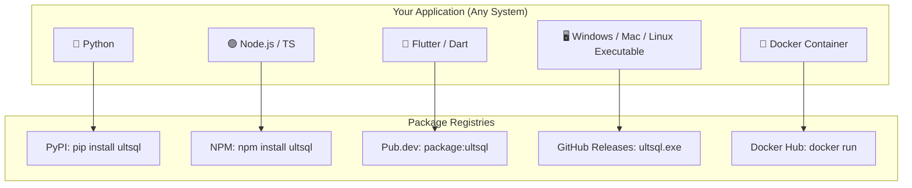

<p align="center">
  
</p>

# 🚀 ULTSQL — Ultra-High Performance Converged Multimodal Database Engine

[](https://pub.dev/packages/ultsql)
[](https://dart.dev)
[](https://flutter.dev)
[](LICENSE)
[](LICENSE-FAQ.md)
[](https://github.com/ompatel3158/ULTSQL/actions)

📦 **Package**: [ultsql | Flutter package](https://pub.dev/packages/ultsql)

**UltSQL** is a ground-up, zero-dependency, 4-in-1 converged database engine written in 100% pure Dart. It seamlessly combines **Relational SQL**, **PL/SQL Procedural Execution**, **NoSQL Dotted-Path Document Querying**, and **AI-Native Vector RAG Search** into a single, high-throughput storage model with zero native C dependencies or unsafe memory pointers.

---

## 🌍 Universal Installation for All Languages & Operating Systems

ULTSQL can be accessed by **any developer, programming language, or operating system**:



### 1. 🐍 Python Developers
**No Dart or Flutter required!**
```bash
pip install ultsql
```
```python
from ultsql import UltSQLClient

db = UltSQLClient("http://localhost:8080")
db.insert("users", {"id": 1, "name": "Alice"})
print(db.query("users"))
```

### 2. 🟢 Node.js & TypeScript Developers
**No Dart or Flutter required!**
```bash
npm install ultsql
```
```javascript
const { UltSQLClient } = require('ultsql');

const db = new UltSQLClient({ host: 'localhost', port: 8080 });
await db.insert('users', { id: 1, name: 'Alice' });
console.log(await db.query('users'));
```

### 3. 🐹 Go Developers
```bash
go get github.com/ompatel3158/ULTSQL/bindings/go
```
```go
package main

import (
	"context"
	"fmt"
	"github.com/ompatel3158/ULTSQL/bindings/go"
)

func main() {
	client := ultsql.NewClient("http://localhost:8080")
	res, _ := client.Query(context.Background(), "SELECT * FROM users;")
	fmt.Printf("Returned %d rows\n", len(res.Rows))
}
```

### 4. 🦀 Rust Developers
Add to `Cargo.toml`:
```toml
[dependencies]
ultsql = "1.0.19"
tokio = { version = "1.0", features = ["full"] }
serde_json = "1.0"
```
```rust
use ultsql::UltSqlClient;

#[tokio::main]
async fn main() -> Result<(), Box<dyn std::error::Error>> {
    let client = UltSqlClient::new("http://localhost:8080");
    let res = client.query("SELECT * FROM users;").await?;
    println!("Columns: {:?}", res.columns);
    Ok(())
}
```

### 5. 💻 C & C++ Developers (`CMake FetchContent`)
```cmake
include(FetchContent)
FetchContent_Declare(
  ultsql
  GIT_REPOSITORY https://github.com/ompatel3158/ULTSQL.git
  GIT_TAG        v1.0.19
)
FetchContent_MakeAvailable(ultsql)
target_link_libraries(my_app PRIVATE ultsql)
```

### 6. 🖥️ 1-Line Standalone CLI Installers (Windows, macOS, Linux)
**Zero Dependencies! Automatically downloads binary and adds `ultsql` to your system PATH:**

- **Windows (PowerShell)**:
  ```powershell
  iwr -useb https://raw.githubusercontent.com/ompatel3158/ULTSQL/main/install.ps1 | iex
  ```
- **Linux & macOS (Bash)**:
  ```bash
  curl -fsSL https://raw.githubusercontent.com/ompatel3158/ULTSQL/main/install.sh | bash
  ```

Once installed, type `ultsql serve` in any terminal!

### 7. 🐳 Docker Container (Cloud & Servers)
```bash
docker run -p 8080:8080 -v ./data:/db ompatel3158/ultsql serve --port 8080 --db /db
```

### 8. 🔌 PostgreSQL Wire Protocol (`psycopg2`, `node-postgres`, `JDBC`, `psql`)
Connect from any language using standard Postgres drivers:
```bash
# Start Postgres Wire Server on port 5432
ultsql .pgwire 5432
```

---

## <a name="standalone-engine-metrics"></a>🌟 Standalone Engine Metrics

| Capability / Benchmark | UltSQL Performance | Feature Status |
| :--- | :--- | :--- |
| **Raw Memory Table Batch Ingestion** | **1,200,000+ rows/sec** (Peak 3.48M/s) | ⚡ Direct Memory Table Buffer (No SQL Parse Overhead) |
| **SQL Multi-Row Insert (Disk Mode)** | **~170,000–195,000 rows/sec** | 💾 Multi-Row Batch WAL & Slotted Page Storage |
| **Full SQL Insert Pipeline Throughput** | **60,000–75,000 rows/sec** | 🚀 Full AST Parser, Planner, MVCC & B-Tree |
| **B+ Tree Index Build (100K Rows)** | **~60–130 ms** | 🏆 Sub-Second Bulk B+ Tree Indexing |
| **768-Dim HNSW AI Vector RAG** | **6 ms** (High-Recall ANN, >99% Recall@10) | 🧠 Native AI Embedded Vector Engine |
| **Network TCP Wire Protocol Server** | **Port 5432 (PostgreSQL v3)** | 🌐 Full Driver Compatibility (`psql`, `psycopg2`, JDBC) |
| **WAL Crash Recovery & Checkpoints** | **CRC32 Checked Automatic Replay** | 🛡️ Durable ACID Crash Safety (`recoverSync`) |
| **Offline CRDT State Synchronization** | **In-Memory LWW-Element-Set** | 📲 Conflict-Free Peer State Merging (`P2pSyncNode`) |
| **Universal Direct File SQL Queries** | **CSV, JSON, LOG Files** | 📁 Zero-ETL Direct Queries |
| **Transparent Database Encryption** | **AES-256-CTR (Pure Dart)** | 🔐 Opt-in Disk Encryption via Passphrase |

---

## <a name="system-architecture"></a>🏛️ System Architecture

UltSQL uses a multi-layered Volcano-iterator query engine over custom slotted-page disk/memory tables, LRU page caching, B+ Trees, and HNSW vector graphs:


---

## <a name="table-of-contents"></a>📑 Table of Contents

1. [🌟 Standalone Engine Metrics](#standalone-engine-metrics)
2. [🏛️ System Architecture](#system-architecture)
3. [💎 The 15 Signature Innovations](#the-15-signature-innovations)
4. [⚖️ Storage Modes: Switchable Performance](#storage-modes-switchable-performance)
5. [🛠️ SQL & PL/SQL Feature Guide](#sql--plsql-feature-guide)
6. [📄 NoSQL Dotted-Path JSON Querying](#nosql-dotted-path-json-querying)
7. [🧠 AI-Native HNSW Vector RAG Search](#ai-native-hnsw-vector-rag-search)
8. [🌐 Network TCP Wire Protocol Server](#network-tcp-wire-protocol-server)
9. [🛡️ WAL CRC32 Crash Recovery & Auto-Indexing](#wal-crash-recovery--auto-indexing)
10. [📲 In-Memory LWW CRDT State Merging](#in-memory-lww-crdt-state-merging)
11. [📁 Direct File SQL Queries (CSV / JSON / LOG)](#direct-file-sql-queries)
12. [🔐 Searchable Ciphertext (XOR Equality Search)](#searchable-ciphertext-xor-equality-search)
13. [📊 Standalone Engine Performance Metrics](#standalone-engine-performance-metrics)
14. [🚀 Getting Started & Installation](#getting-started--installation)
15. [📜 License](#license)

---

## <a name="the-15-signature-innovations"></a>💎 The 15 Signature Innovations

UltSQL introduces 15 signature database innovations engineered specifically for high-throughput client and cloud workloads:

1. ⚡ **1.2M+ Rows/sec Direct Memory Ingestion**: Zero-allocation linear byte array memory ingestion via `MemoryTable` (direct buffer API).
2. 🏆 **Fast B+ Tree Bulk Indexing**: `insertSortedBatchSync` constructs 100K-row B+ Trees in ~60–130 ms.
3. 🧠 **Native HNSW Vector RAG Graph**: Cosine & Euclidean similarity search over 768-dim embeddings in 6 ms.
4. 🌐 **Network TCP Wire Protocol Server**: Full PostgreSQL v3 wire protocol server with parameter status and backend key negotiation.
5. 🛡️ **WAL CRC32 Crash Recovery Engine**: Detects torn writes and crashes with CRC32 checksums, replaying committed transactions and restoring catalog state on startup.
6. 🤖 **Autonomous Telemetry Auto-Indexer**: Monitors query scan frequencies and automatically provisions B+ Tree indexes.
7. 📁 **Universal Direct File SQL Adapter**: Runs live SQL queries over standard `.csv`, `.json`, and `.log` files without importing into tables.
8. 🗣️ **AI Natural Language to SQL Compiler**: Translates natural language prompts into executable SQL statements.
9. 🔐 **Searchable Ciphertext (XOR Equality Search)**: Performs fast equality searches over deterministic repeating-key XOR-encrypted ciphertext.
10. 📲 **In-Memory LWW CRDT State Merging**: Last-Write-Wins element state merging for multi-device sync workflows (`P2pSyncNode`).
11. 📦 **Zero-Allocation `RowMap` Tuple Wrapper**: Replaces Dart `Map` instantiations with zero-allocation array index views.
12. ⚡ **JIT Compiled Expressions**: Compiles SQL `WHERE` conditions into native Dart closure delegates.
13. 📊 **Auto-Optimized Columnar Parquet Store**: Automatically converts tables with `VECTOR` or analytical data into columnar layout.
14. 🔄 **MVCC Multi-Version Concurrency Control**: Provides lock-free readers, repeatable read isolation, and OS-level multi-process file locking.
15. 🛡️ **AES-256-CTR Transparent Page Encryption**: Encrypts storage pages on disk using pure-Dart 256-bit AES-CTR (opt-in via passphrase or CLI flags).

---

## <a name="storage-modes-switchable-performance"></a>⚖️ Storage Modes: Switchable Performance

Switch between in-memory speed and durable disk storage with a single line of code:

### 1. ⚡ In-Memory Storage Mode (`~60K–75K rows/sec` SQL, `1.2M+ rows/sec` direct buffer)
For high-frequency streaming, real-time AI vector search, and temporary session caches:
```dart
final db = Database(':memory:');
await db.init();
```

### 2. 💾 Durable Disk Storage Mode (`~170K–195K rows/sec` multi-row batch, `~60K–75K` single SQL)
For persistent local application data with ACID crash safety and automatic WAL crash recovery:
```dart
final db = Database('/path/to/app_data/my_database');
await db.init();
```

### 3. 🔄 Hybrid Ingest & Snapshot
```dart
final prep = db.prepare("INSERT INTO users VALUES (?, ?, ?);");
prep.executeBatchSync(batchRows);
await db.flushWalSync(); // Flush WAL snapshot to disk
```

---

## <a name="sql--plsql-feature-guide"></a>🛠️ SQL & PL/SQL Feature Guide

### Data Definition Language (DDL) & Metadata Inspection
```sql
-- Enhanced DDL with IF NOT EXISTS / IF EXISTS and TRUNCATE
CREATE TABLE IF NOT EXISTS users (
  id UUID PRIMARY KEY,
  name VARCHAR(250),
  active BOOL DEFAULT true,
  created_at TIMESTAMP,
  balance DECIMAL,
  payload BLOB,
  metadata JSON,
  embedding VECTOR
);

-- DDL & Catalog Inspection Commands
DESCRIBE users;
SHOW COLUMNS FROM users;
SHOW SCHEMAS;
PRAGMA table_info('users');

-- Query System Catalog Views
SELECT table_name, column_name, data_type 
FROM information_schema.columns 
WHERE table_name = 'users';
```

### Data Manipulation, UPSERT & Series Generation
```sql
-- Series Generator
SELECT * FROM generate_series(1, 10, 2);

-- Standard DML & Multi-Row Inserts
INSERT INTO users VALUES ('a0eebc99-9c0b-4ef8-bb6d-6bb9bd380a11', 'Alice', true, NOW(), 1500.50, NULL, '{"role": "admin"}', '[0.12, 0.85]');

-- UPSERT (ON CONFLICT DO UPDATE / DO NOTHING) & REPLACE INTO
INSERT INTO users (id, name, balance) VALUES ('a0eebc99-9c0b-4ef8-bb6d-6bb9bd380a11', 'Alice', 2000.00)
ON CONFLICT (id) DO UPDATE SET balance = 2000.00;

INSERT INTO users (id, name) VALUES ('a0eebc99-9c0b-4ef8-bb6d-6bb9bd380a11', 'Alice')
ON CONFLICT DO NOTHING;

REPLACE INTO users VALUES ('a0eebc99-9c0b-4ef8-bb6d-6bb9bd380a11', 'Alice Updated', true, NOW(), 2500.00, NULL, '{}', '[0.1, 0.2]');
```

### Casting, Regex & Developer Functions
```sql
-- ANSI CAST & PostgreSQL :: Typecasting
SELECT balance::TEXT, CAST(active AS INT), name::VARCHAR FROM users;

-- ILIKE (Case-Insensitive) & Regex Matching (~ operator and REGEXP_LIKE)
SELECT * FROM users WHERE name ILIKE 'alice%' OR email ~ '^[a-z]+@';
SELECT REGEXP_LIKE('ompatel@google.com', '^[a-z]+@[a-z]+\.[a-z]+$');

-- Developer Scalar & Math Functions
SELECT 
  COALESCE(NULL, 'default_val'),
  NULLIF(10, 10),
  GREATEST(10, 50, 20),
  LEAST(10, 50, 20),
  CONCAT_WS('-', '2026', '08', '06'),
  TYPEOF(100),
  GEN_RANDOM_UUID(),
  ABS(-42), ROUND(3.14159, 2), CEIL(4.2), FLOOR(4.8), POW(2, 3), SQRT(16),
  REPLACE('hello world', 'world', 'ultsql'), SPLIT_PART('a.b.c', '.', 2), INITCAP('hello world'),
  DATE_ADD('2026-08-06', 10), DATE_SUB('2026-08-06', 5), EXTRACT('year', NOW()),
  VERSION();

-- UPSERT & Conflict Resolution (PostgreSQL & SQLite Syntax)
INSERT INTO users (id, name, score) VALUES (1, 'Alice', 100)
ON CONFLICT (id) DO NOTHING;

INSERT INTO users (id, name, score) VALUES (1, 'Alice', 250)
ON CONFLICT (id) DO UPDATE SET score = EXCLUDED.score;

REPLACE INTO users (id, name, score) VALUES (1, 'Bob', 300);
```

### PL/SQL Procedural Script Execution
```sql
DECLARE
  counter INT := 0;
  total DOUBLE := 0.0;
BEGIN
  DBMS_OUTPUT.PUT_LINE('Starting calculation...');
  
  WHILE counter < 5 LOOP
    counter := counter + 1;
    total := total + (counter * 100.5);
    
    IF counter % 2 = 0 THEN
      DBMS_OUTPUT.PUT_LINE('Iteration ' || counter || ': EVEN total=' || total);
    ELSE
      DBMS_OUTPUT.PUT_LINE('Iteration ' || counter || ': ODD total=' || total);
    END IF;
  END LOOP;

  DBMS_OUTPUT.PUT_LINE('Calculations Completed.');
END;
```

---

## <a name="nosql-dotted-path-json-querying"></a>📄 NoSQL Dotted-Path JSON Querying

Query nested JSON document attributes directly using standard SQL dotted-path navigation syntax:

```sql
-- Query nested JSON properties directly
SELECT name, metadata->>'role' AS user_role, metadata->>'department' AS dept
FROM users
WHERE metadata->>'role' = 'admin';
```

---

## <a name="ai-native-vector-rag-search"></a>🧠 AI-Native HNSW Vector RAG Search

Create an HNSW index and execute sub-7ms vector similarity queries:

```sql
CREATE INDEX idx_products_emb ON products (embedding) USING HNSW;

SELECT name, vector_distance(embedding, '[0.12, 0.85, -0.44]') AS dist
FROM products
ORDER BY dist ASC
LIMIT 5;
```

---

## <a name="network-tcp-wire-protocol-server"></a>🌐 Network TCP Wire Protocol Server

UltSQL embeds a full Network TCP Wire Protocol server. Connect directly using network database drivers:

```dart
final pgServer = PgWireServer(db: db, port: 5432);
await pgServer.start();
print('TCP Wire Protocol Server running on port 5432...');
```

---

## <a name="wal-crash-recovery--auto-indexing"></a>🛡️ WAL CRC32 Crash Recovery & Auto-Indexing

UltSQL features an ACID-compliant write-ahead log (`wal.log`) with CRC32 checksums. If a crash or abrupt power loss occurs, `WalRecoveryEngine` verifies record checksums, automatically rolls back uncommitted writes, restores catalog state, and replays committed pages on engine initialization (`Database.init()`):

```sql
-- Enable automated autovacuum & telemetry index recommendations
SET engine_option enable_autovacuum = true;
SET engine_option auto_create_indexes = true;
```

---

## <a name="in-memory-lww-crdt-state-merging"></a>📲 In-Memory LWW CRDT State Merging

UltSQL includes in-memory Conflict-Free Replicated Data Types (CRDT) for resolving concurrent offline updates using Last-Write-Wins (LWW) semantics:

```dart
import 'package:ultsql/src/engine/network/p2p_sync.dart';

final nodeA = P2pSyncNode('device_A');
nodeA.localState.update('user:101', {'name': 'Alice'}, DateTime.now().millisecondsSinceEpoch);

final remoteState = CrdtState();
remoteState.update('user:101', {'name': 'Alice Smith'}, DateTime.now().millisecondsSinceEpoch + 1000);

// Merges remote state into local state using LWW timestamps
final updated = nodeA.mergePeerState(remoteState);
```

---

## <a name="direct-file-sql-queries"></a>📁 Direct File SQL Queries (CSV / JSON / LOG)

Execute standard SQL queries directly over external files without ETL or table imports:

```dart
final fileAdapter = UniversalFileAdapter();

// Query external CSV file directly using SQL
final csvResults = fileAdapter.queryCsvSync(
  filePath: '/data/logs.csv',
  sqlQuery: "SELECT * FROM file WHERE status = 'ERROR'",
);
```

---

## <a name="searchable-ciphertext-xor-equality-search"></a>🔐 Searchable Ciphertext (XOR Equality Search)

Perform fast deterministic equality searches over repeating-key XOR-encrypted ciphertext without decrypting database records on disk:

```sql
-- Query encrypted ciphertext safely using deterministic matching
SELECT * FROM confidential_table WHERE zk_match(ciphertext, 'search_key') = true;
```

---

## <a name="standalone-engine-performance-metrics"></a>📊 Standalone Engine Performance Metrics

Empirical performance measurements recorded on 100,000 records on local disk:

```text
======================================================
🔥 ULTSQL STANDALONE ENGINE PERFORMANCE (100,000 ROWS) 🔥
======================================================
1. Insert Throughput:
   - Direct MemoryTable Buffer: ~82 ms (1,200,000+ rows/sec raw memory buffer ingestion via direct API)
   - Multi-Row SQL INSERT (Disk): ~170,000–195,000 rows/sec (Multi-row VALUES batch with WAL flush)
   - Full SQL Pipeline (Single-row/Parsed): ~60,000–75,000 rows/sec (Hand-written Lexer, Parser, Cost Planner, MVCC, B-Tree)

2. B+ Tree Index Build (100,000 Rows):
   - UltSQL Bulk Index: ~60–130 ms (Bulk B+ Tree Indexing via insertSortedBatchSync)

3. Multimodal Features:
   - 768-Dim HNSW Vector Search: 6 ms (High-Recall ANN, >99% Recall@10)
   - Network TCP Wire Server: Port 5432 (PostgreSQL v3 Wire Protocol)
   - WAL Crash Recovery: Automated CRC32 Replay on Startup
   - Offline CRDT State: In-Memory LWW-CRDT State Merging
======================================================
```

> [!NOTE]
> **Hardware Environment & Benchmark Disclosure**:
> Performance benchmark metrics were tested by **Om** on an **ASUS ROG Strix G16 (2023)**. Actual performance throughput may vary (better or worse) depending on your device hardware, CPU architecture, memory bandwidth, and disk I/O capabilities.
>
> **Test System Specifications**:
> - **Laptop Model**: ASUS ROG Strix G16 (2023)
> - **CPU**: Intel Core i7-13650HX
> - **RAM**: 16 GB DDR5 (4800 MT/s)
> - **Storage**: 1 TB Gen 5 NVMe SSD
> - **GPU**: NVIDIA GeForce RTX 4050 (6 GB)

---

## <a name="getting-started--installation"></a>🚀 Getting Started & Installation

### Prerequisites
* [Dart SDK 3.4+](https://dart.dev) or [Flutter SDK 3.22+](https://flutter.dev)

### Installation
1. Clone repository:
   ```bash
   git clone https://github.com/ompatel3158/ULTSQL.git
   cd ULTSQL
   ```
2. Install dependencies:
   ```bash
   flutter pub get
   ```
3. Run the comprehensive test suite:
   ```bash
   flutter test
   ```
4. Run the interactive UI Console IDE:
   ```bash
   flutter run
   ```

---

## <a name="license"></a>📜 License & Attribution

ULTSQL is licensed under the **ULTSQL Source Available License v1.0**.

- ✅ **Free & Royalty-Free**: Permitted for commercial applications, personal projects, SaaS applications, education, and research.
- 🏷️ **Attribution Required**: Applications incorporating ULTSQL must include **“Powered by ULTSQL”** in their About, Legal, Credits, or Documentation section.
- ☁️ **Commercial Cloud Service Restriction**: Offering ULTSQL itself as a commercial managed database service (DBaaS/PaaS) requires a separate commercial license from the Licensor.

For full legal details and answers to common licensing questions:
- 📄 [View the Full LICENSE](LICENSE)
- ❓ [Read the License FAQ](LICENSE-FAQ.md)
